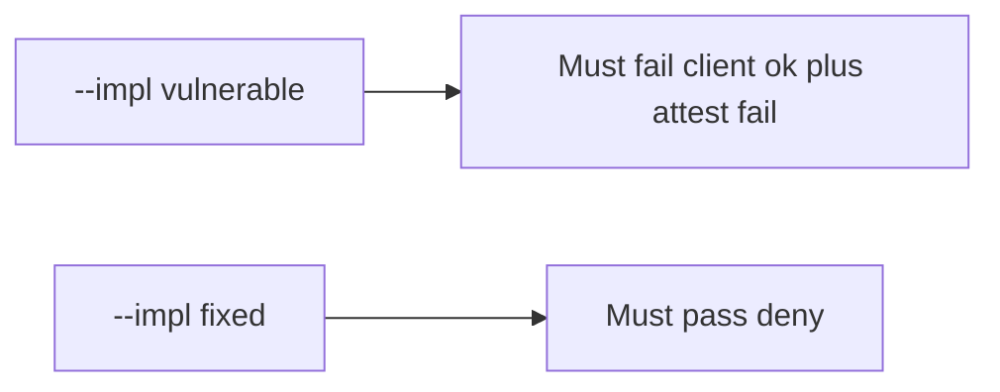

# 8.1-LO-05 — Evidence is client claim ignored, then a passing pair

**Kind:** verification-lab
**Loop step:** 5 Verify
**Standards:** OWASP ASVS 5.0.0 (final) `v5.0.0-8.3.1`. MASVS 2.1.0 (final) `MASVS-PLATFORM`.

## An invariant that cannot fail a test is still a slogan

“We use Play Integrity” is not evidence. “The Compose button is disabled” is a mechanism observation. The oracle is: `allow_export({"integrity": "ok"}, "fail")` is false and `allow_export({"integrity": "ok"}, "play_integrity_pass")` may be true. The client-ok-plus-attest-fail observation must be **false** on `--impl vulnerable` (returns true) and **true** on `--impl fixed`. Do not call live attestation APIs.

## Mental model: vulnerable must fail: client ok plus attest fail

The failing observation on `--impl vulnerable` is **client ok plus attest fail**. A passing collection count is not this cell.



| Mode | Must show for this module |
|---|---|
| Negative / abuse | client ok, attest fail → false; vulnerable must fail |
| Normal | client ok, attest pass → true (may pass on both) |
| Empty | missing client claim, attest fail → false |
| Not claimed | emulator farms; 4.4 object grant; live Play; MASVS-RESILIENCE-1 on a device |

Lab tests in `labs/8.1/8.1-lab/tests/test_property.py`. `test_client_integrity_claim_is_not_authorization` is a **forbidden-outcome** test: a client boolean that authorizes export is not allowed to count as a passing control.

```text
python3 -m pytest labs/8.1/8.1-lab/tests --impl vulnerable
python3 -m pytest labs/8.1/8.1-lab/tests --impl fixed
```

Honest server-pass may pass on both implementations. That does not excuse the failing-attest deny test. If vulnerable does not fail `test_client_integrity_claim_is_not_authorization`, the lab is miswired—fix the wiring, not the assertion.

## What the tests do not prove

- Real Play Integrity token verification
- MASVS-RESILIENCE-1 on a physical device
- 8.4 debug/release split
- iOS App Attest (later mirror)
- 4.4 object grants after export is allowed
- 6.7 quota

Record those as residuals or later modules, not as silent passes.

## Practice

Execute both implementations this session from the lab directory if needed. Write the fail/pass pair next to the matrix row. Reject a “test” that only greps `PlayIntegrity` in Gradle without calling `allow_export({"integrity": "ok"}, "fail")`.

## Transfer

Clinic: a test that only asserts the Android button is disabled is not this cell. A live Play Console call is out of scope.

## Non-goals

Do not add a device-farm trophy. Do not log attestation blobs. Keys stay out of this file. Do not use MASVS L1/L2/R.
