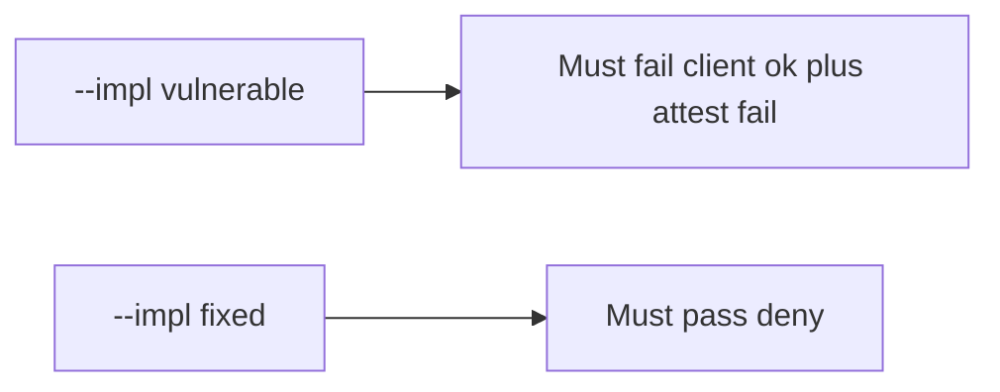

# 8.1-LO-05 — Evidence is client claim ignored, then a passing pair

**Kind:** verification-lab
**Loop step:** 5 Verify
**Standards:** OWASP ASVS 5.0.0 (final) `v5.0.0-8.3.1`.

## An invariant that cannot fail a test is still a slogan

“We use Play Integrity” is not evidence. The oracle is the local pair. Do not call live attestation APIs.

## Mental model: fail-on-vulnerable, pass-on-fixed



| Case | Must show |
|---|---|
| Negative / abuse | client ok, attest fail → false |
| Normal | client ok, attest pass → true |
| Not claimed | emulator farms; 4.4 object grant; live Play |

```
python3 -m pytest labs/8.1/8.1-lab/tests --impl vulnerable
python3 -m pytest labs/8.1/8.1-lab/tests --impl fixed
```

Honest server-pass may pass on both.

## What the tests do not prove

- Real Play Integrity token verification
- MASVS-RESILIENCE-1 on a physical device
- 8.4 debug/release split
- iOS App Attest (later mirror)

## Practice

Execute both implementations. Map each test to an LO-02 cell.

## Transfer

Clinic: a test that only asserts the Android button is disabled is not this cell.
