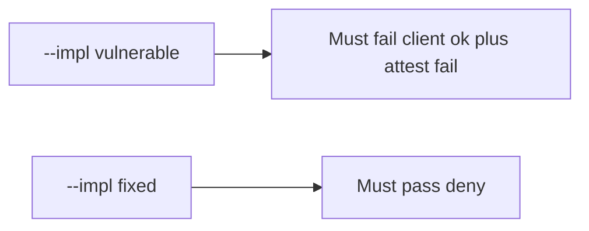

# Fail on the broken files, then pass on the repaired ones

**Kind:** verification-lab
**Loop step:** 5 Verify

## If you cannot test it, it is still a slogan

“We use Play Integrity” is not evidence. “The Compose button is disabled” is a tool observation. The check is: `allow_export({"integrity": "ok"}, "fail")` is false, and `allow_export({"integrity": "ok"}, "play_integrity_pass")` may be true. The client-ok-plus-attest-fail observation must be **false** on `--impl vulnerable` (returns true) and **true** on `--impl fixed`. Do not call live attestation APIs.

## Picture: broken files must fail: client ok plus attest fail

A check that only counts passing cases can pass while client `integrity=ok` still authorizes export. This check asks whether that grant still counts as a passing control. Broken must fail that question. Repaired must pass it.



If both pass, the check is not looking at the client boolean. If both fail, the fix is not structural or the check is wrong.

## Three observations, even for export

| Mode | Must show for this topic |
|---|---|
| Wrong input / abuse | client ok, attest fail → false; broken files must fail (`test_client_integrity_claim_is_not_authorization`) |
| Normal | client ok, attest pass → true (`test_server_attest_may_allow_export`; may pass on both) |
| Extra | missing client claim, attest fail → false (`test_missing_client_claim_does_not_authorize`) |
| Not claimed | emulator farms; 4.4 object grant; live Play; platform integrity on a physical phone |

Practice checks live in `labs/8.1/8.1-lab/tests/test_property.py`. `test_client_integrity_claim_is_not_authorization` is a **what-must-not-happen** check: a client boolean that authorizes export is not allowed to count as a passing control.

```text
python3 -m pytest labs/8.1/8.1-lab/tests --impl vulnerable
python3 -m pytest labs/8.1/8.1-lab/tests --impl fixed
```

Honest server-pass may pass on both implementations. That does not excuse the failing-attest deny check. If the broken files do not fail `test_client_integrity_claim_is_not_authorization`, the practice is miswired — fix the wiring, not the check.

## What the checks do not prove

- Real Play Integrity token verification
- Platform integrity on a physical phone
- 8.4 debug/release split
- iOS App Attest (later mirror)
- 4.4 object grants after export is allowed
- 6.7 quota

Record those as leftover risk or later topics, not as silent passes.

## Practice

Run both implementations this session from the lab directory if needed. Write the fail/pass pair next to the map-page row. Reject a “check” that only greps `PlayIntegrity` in Gradle without calling `allow_export({"integrity": "ok"}, "fail")`. An environment error is not security evidence.

## Use it somewhere new

Clinic: a check that only asserts the Android button is disabled is not this cell. A live Play Console call is out of scope.

## What this page is not doing

Do not add a device-farm trophy. Do not log attestation blobs. Answer keys are not on this site.
