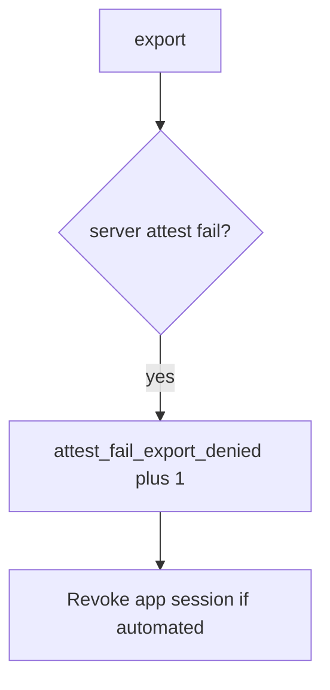

# Log the deny, not the app file

**Kind:** operations-exercise
**Loop step:** 6 Operate

## Fixing it once is not enough

A new client field (`premium`, `hipaaMode`) can skip the attest check after `allow_export` was “fixed once.” Pair notice and recover. Do not log note bodies or attestation blobs (3.1). Do not attach the Android app file to the ticket.

## Picture: failed attest is a signal



This still does not prove the server attest.

## Signals that do not become a second leak

| Outcome | This topic |
|---|---|
| Notice | `attest_fail_export_denied` |
| What the line holds | request id, app version, attest result class; never the app file or body |
| Recover | Keep deny; revoke tokens; owned rooted-device policy |
| Leftover | Attestation farms; 8.4 debug clients; old app files shipping the boolean |

Naming a mobile-device product is not the rule. Re-run `test_client_integrity_claim_is_not_authorization` after any export-route change; a green “Play Integrity enabled” tile is not that check. Feature flags and `premium=true` are other client booleans of the same family — list them before you claim Recover.

## What the framework does vs what you still have to check

A Play Console dashboard will show attestation counts and stay silent when FastAPI still binds `integrity=ok`. Notice must observe **client ok plus attest fail is false**, not store-listing health. If the alert includes a Play Integrity token or note bodies, you have opened a logging leak (3.1 / 4.3).

What this practice is supposed to show: `attest_fail_export_denied` fires without the app file. A vendor name is not this week's rule.

## Practice

Write one log line you would accept in review. Tie it to `labs/8.1/8.1-lab`. Example shape (fake ids only):

```text
log_denied reason=attest_fail_export_denied app_ver=1.0 request_id=req_81e
```

Reject any line that includes note bodies, a Play Integrity token, or a live device trace.

## Use it somewhere new

A clinic example: notice `hipaaMode` client claims on a local helper; do not attach the chart to the ticket. Do not instrument a live hospital device.

## Can people still use it

If export is denied, say so in a readable message. Do not trap TalkBack users in a spinner that retries a failing attest.

## What this page is not doing

Naming a mobile-device product is not the rule. Live Play traces are out of scope. Opening this page does not finish a check-in.
