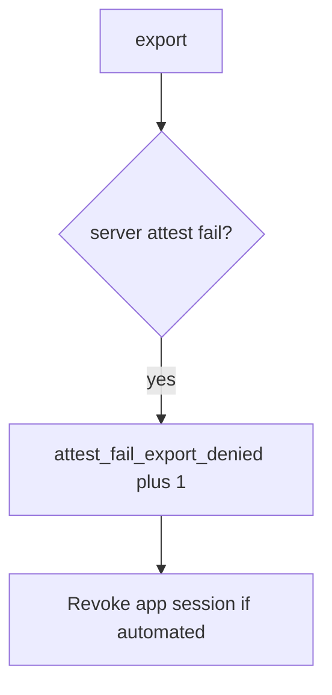

# 8.1-LO-06 — Detect attest_fail_export_denied without logging the APK

**Kind:** operations-exercise
**Loop step:** 6 Operate
**Standards:** NIST CSF 2.0 (final) DE/RS/RC as outcome labels; MASVS 2.1.0 (final) `MASVS-PLATFORM`; ASVS 5.0.0 (final) `v5.0.0-8.3.1`. CSF names outcomes; it does not verify attest.

## Prevention is not absolute

A new client field (`premium`, `hipaaMode`) can skip the attest check after `allow_export` was “fixed once.” Pair detect and recover. Do not log note bodies or attestation blobs (3.1). Do not attach the APK to the ticket.

## Mental model: failed attest is a signal



| Outcome | This module |
|---|---|
| Detect | `attest_fail_export_denied` |
| Signal | request id, app version, attest result class; never the APK or body |
| Recover | Keep deny; revoke tokens; owned rooted-device policy |
| Residual | Attestation farms; 8.4 debug clients; old APKs shipping the boolean |

CSF 2.0 Detect / Respond / Recover name outcomes. They do not prove `v5.0.0-8.3.1`. An MDM product name is not the property. Re-run `test_client_integrity_claim_is_not_authorization` after any export-route change; a green “Play Integrity enabled” tile is not that pytest. Feature flags and `premium=true` are other client booleans of the same family — inventory them before claiming Recover.

## Framework defaults versus the operate guarantee

A Play Console dashboard will show attestation counts and stay silent when FastAPI still binds `integrity=ok`. Detection must observe **client ok plus attest fail is false**, not store-listing health. If the alert includes a Play Integrity JWT or note bodies, you have opened a 3.1 / 4.3 cell.

## Practice

Write one log line you would accept. Tie it to `labs/8.1/8.1-lab`.

```text
log_denied reason=attest_fail_export_denied app_ver=1.0 request_id=req_81e
```

Reject any line that includes note bodies, a Play Integrity JWT, or a live device trace.

## Transfer

Clinic: detect `hipaaMode` client claims on a local fixture; do not attach the chart to the ticket. Do not instrument a live hospital device.

## Usability

If export is denied, say so in a readable message (WCAG 2.2 Success Criterion 4.1.3). Do not trap TalkBack users in a spinner that retries a failing attest.

## Non-goals

An MDM product name is not the property. Live Play traces are out of scope. Gates 0–10 stay not-attempted. Do not use MASVS L1/L2/R.
