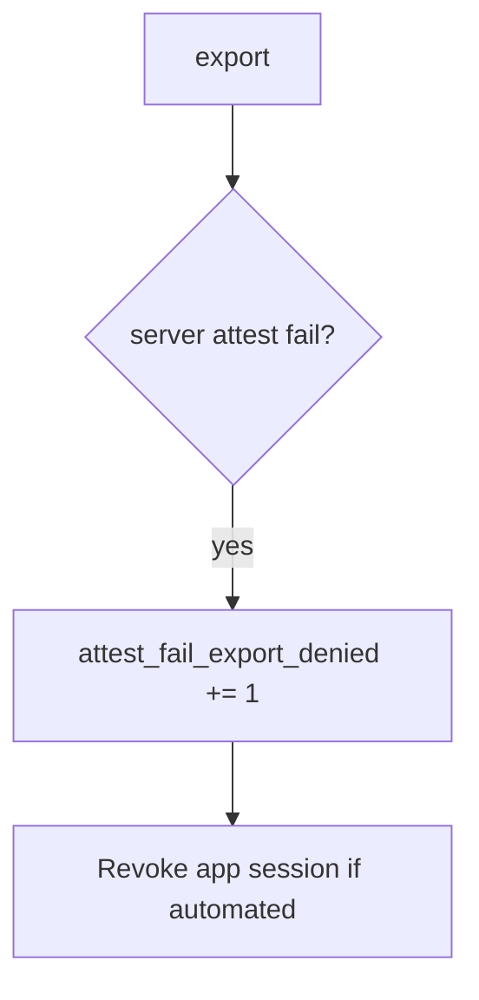

# 8.1-LO-06 — Detect attest_fail_export_denied without logging the APK

**Kind:** operations-exercise
**Loop step:** 6 Operate
**Standards:** NIST CSF 2.0 (final) DE/RS/RC as outcome labels; MASVS 2.1.0 `MASVS-PLATFORM`.

## Prevention is not absolute

A new client field (`premium`, `hipaaMode`) can skip the attest check. Pair detect and recover. Do not log note bodies or attestation blobs (3.1).

## Mental model: failed attest is a signal



| Outcome | This module |
|---|---|
| Detect | `attest_fail_export_denied` |
| Signal | request id, app version, attest result class; never the APK or body |
| Recover | Keep deny; revoke tokens; owned rooted-device policy |
| Residual | Attestation farms; 8.4 debug clients |

## Practice

Write one log line you would accept. Tie it to `labs/8.1/8.1-lab`.

```
log_denied reason=attest_fail_export_denied app_ver=1.0 request_id=req_81e
```

Reject any line that includes note bodies, a Play Integrity JWT, or a live device trace.

## Transfer

Clinic: detect `hipaaMode` client claims; do not attach the chart to the ticket.

## Non-goals

A MDM product name is not the property.
