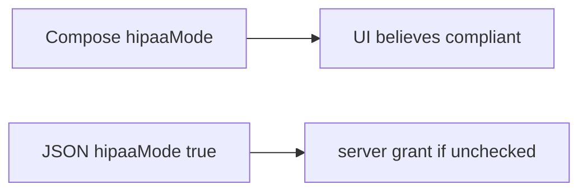

# 8.1-LO-07 — Transfer: clinic Android hipaaMode=true

**Kind:** transfer-challenge
**Loop step:** 7 Transfer
**Standards:** OWASP MASVS 2.1.0 (final) `MASVS-PLATFORM`. Mobile Top 10:2024 awareness after.

## Change the workplace; keep the server as TCB

Do not answer with a Top 10 / CWE / scanner as the definition of security.

**Prompt:** Clinic Android client sends `hipaaMode=true`. Also name APK feature flags and `premium=true`.

**Product sketch:** EHR-lite Compose switch “HIPAA mode” that the API trusts as a boolean.

Rewrite the SecureCollab sentence. Include:

1. attacker capabilities (patched clinic APK — not a live hospital device);
2. trust assumptions (server attest + 1.2 is TCB; client boolean and store listing are not);
3. forbidden outcome (`allow_export` true on client claim with failing attest, not “HIPAA”);
4. a test idea on a **local** fixture only (no live Play);
5. residual (attestation farms, rooted honest clinicians, 8.4 debug builds);
6. WCAG if a human deny path exists (readable “export unavailable,” not a silent crash).

## Mental model: a client switch is still a client claim

## What graders reject

| Reject | Why |
|---|---|
| “Play Integrity is on” | Signal, not 1.2 |
| Live clinic device / Frida | Lab policy |
| “MASVS L2” | Obsolete MASVS levels |

## Practice

One page. No keys. `labs/8.1/8.1-lab` is the only running system you may break.
