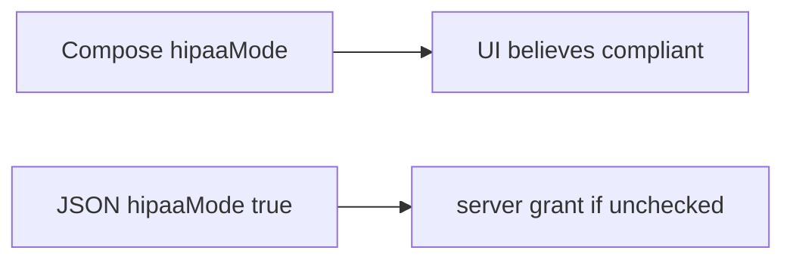

# Same idea on a clinic Android app that sets hipaaMode=true

**Kind:** transfer-challenge
**Loop step:** 7 Transfer

## Use it somewhere new

You get a clinic Android client that sends `hipaaMode=true`. Also name feature flags in the app file and `premium=true`.

`allow_export({"integrity": "ok"}, "fail")` must be false.

An EHR-lite Compose switch “HIPAA mode” that the API trusts as a boolean.

## Picture: a client switch is still a client claim

`hipaaMode` is `integrity` under another name. If the Compose switch is “HIPAA mode” while the server binds `hipaaMode=true` as a grant, the rule is gone. Play Integrity in the app, shrinking the app, and the store listing do not ignore the client boolean. Feature flags and `premium=true` are the same claim family — name them, do not run those app files here. The phone sandbox still does not put this process in what you trust (the first page).

| Notes app | Clinic sketch |
|---|---|
| Patched notes-app file sending `integrity=ok` | Patched clinic app file sending `hipaaMode=true` — not a live hospital device |
| `allow_export({"integrity": "ok"}, "fail")` | Clinic export on client `hipaaMode` with failing attest |
| Server attest is what you trust | Same; Compose switch and store listing are not |
| Feature flags / `premium=true` leftover | Same claim family — name them, do not run them here |

## Write this for a clinic Android hipaaMode=true

1. who might try (patched clinic app file — not a live hospital device);
2. what you trust (server attest plus 1.2 is what you trust; client boolean and store listing are not);
3. what must not happen (`allow_export` true on a client claim with failing attest, not “HIPAA”);
4. keep it on **local** practice files only (no live Play);
5. leftover risk (attestation farms, rooted honest clinicians, 8.4 debug builds);
6. the accessibility baseline if a human deny path is in the claim (readable “export unavailable,” not a silent crash).

A client claim plus a failing attest still has to be false. A server-pass may still allow. Enabling Play Integrity without a failing-attest deny check leaves `allow_export({integrity: ok}, fail)` true. The local check is `test_client_integrity_claim_is_not_authorization` — on the practice files, not a live hospital device.

## What is not good enough

| Reject | Why |
|---|---|
| “Play Integrity is on” | Signal, not 1.2 |
| Live clinic device | Course rules |
| Old numbered mobile levels as current | Not current levels |
| Compose disabled as the grant | Client is not what you trust |
| Store listing as device trust | Package id, not next JSON |

## Practice

Ignore the client `premium` boolean on export. Keep the answer keys closed. `labs/8.1/8.1-lab` is the only running system you may break. Do not instrument a public device.

## What this page is not doing

Do not try live-target mobile attacks. Do not use real BAA flags. This page does not finish a check-in.
