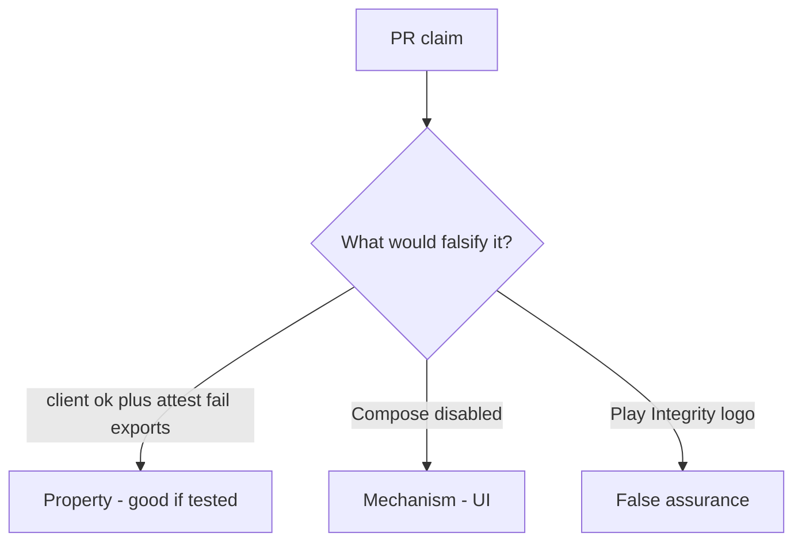

# 8.1-LO-08 — Review client booleans as a PR, not a MASVS sticker

**Kind:** code-review
**Loop step:** Review
**Standards:** OWASP MASVS 2.1.0 (final) `MASVS-PLATFORM`. ASVS 5.0.0 (final) `v5.0.0-8.3.1`. Do not use MASVS L1/L2/R.

## Review the fixture as if it were SecureCollab Android export

Review `labs/8.1/8.1-lab/vulnerable/` as a SecureCollab PR. Your job is not to count suspicious lines. Reconstruct whether `allow_export({"integrity": "ok"}, "fail")` still returns true, compare that with the module invariant, and write changes a developer can verify.

Intended findings live only in `content/assessment/keys/8.1.md` — not here. Do not open the keys file until your review has been evaluated.

## Mental model: if integrity==ok: export

Start with this seeded smell: **`if integrity==ok: export`**. Label it property, mechanism, or false assurance before you accept the PR.

Classification starts at the protected effect (client ok plus attest fail denied). Everything that is not a server-attest check at that call is a candidate client-boolean path. A Play Integrity logo without that pytest is the same smell, not a different finding class.

R8 and `MASVS-RESILIENCE-1` raise cost; they do not become 1.2. Feature flags and 8.4 debug clients are other hostile-client paths — name them, do not skip `test_client_integrity_claim_is_not_authorization`.

## Seeded smells (label them yourself)

- `if integrity==ok: export`
- No server-attest test
- Secrets in the APK (8.4)
- MASVS used as a sticker / obsolete L1/L2/R

Also reject: live device farms; Frida cookbooks; closing findings without re-running `test_client_integrity_claim_is_not_authorization`; keys in lessons.

## Misconceptions this module refuses

- Obfuscation is authorization
- Kotlin is the guarantee
- Store listing equals device trust
- Play Integrity in the app is 1.2
- MASVS L1/L2/R are current levels

## Practice

Write three review notes a maintainer could act on. Each note: observation, property or false assurance, suggested structural change, residual you will **not** delete. Tie at least one to `test_client_integrity_claim_is_not_authorization`.

## Transfer

Clinic PR that “enabled Play Integrity” without a failing-attest deny test is an incomplete mediation review. Name the independent falsehood that would still keep client ok plus attest fail false.

## Non-goals

Do not merge by adding a comment “will attest later.” That comment is a residual without an owner. Do not instrument a live device to prove the finding.
