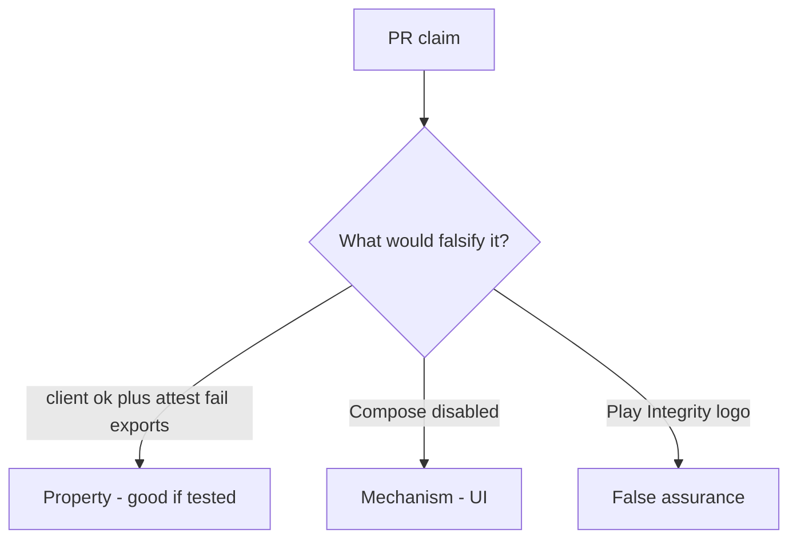

# 8.1-LO-08 — Review client booleans as a PR, not a MASVS sticker

**Kind:** code-review
**Loop step:** Review
**Standards:** OWASP MASVS 2.1.0 (final) `MASVS-PLATFORM`.

## Review the fixture as if it were SecureCollab Android export

Review `labs/8.1/8.1-lab/vulnerable/` as a SecureCollab PR. Intended findings live only in `content/assessment/keys/8.1.md` — not here.

## Mental model: property, mechanism, or false assurance

Seeded smells (label them yourself; do not open the keys file):

- `if integrity==ok: export`
- No server-attest test
- Secrets in the APK (8.4)
- MASVS used as a sticker / obsolete L1/L2/R

Also reject: live device farms, Frida cookbooks, keys in lessons.

## Misconceptions

- Obfuscation is authorization
- Kotlin is the guarantee
- Store listing equals device trust

## Practice

Write three review notes. Tie at least one to `test_client_integrity_claim_is_not_authorization`.

## Transfer

Clinic PR that “enabled Play Integrity” without a failing-attest deny test is incomplete.
