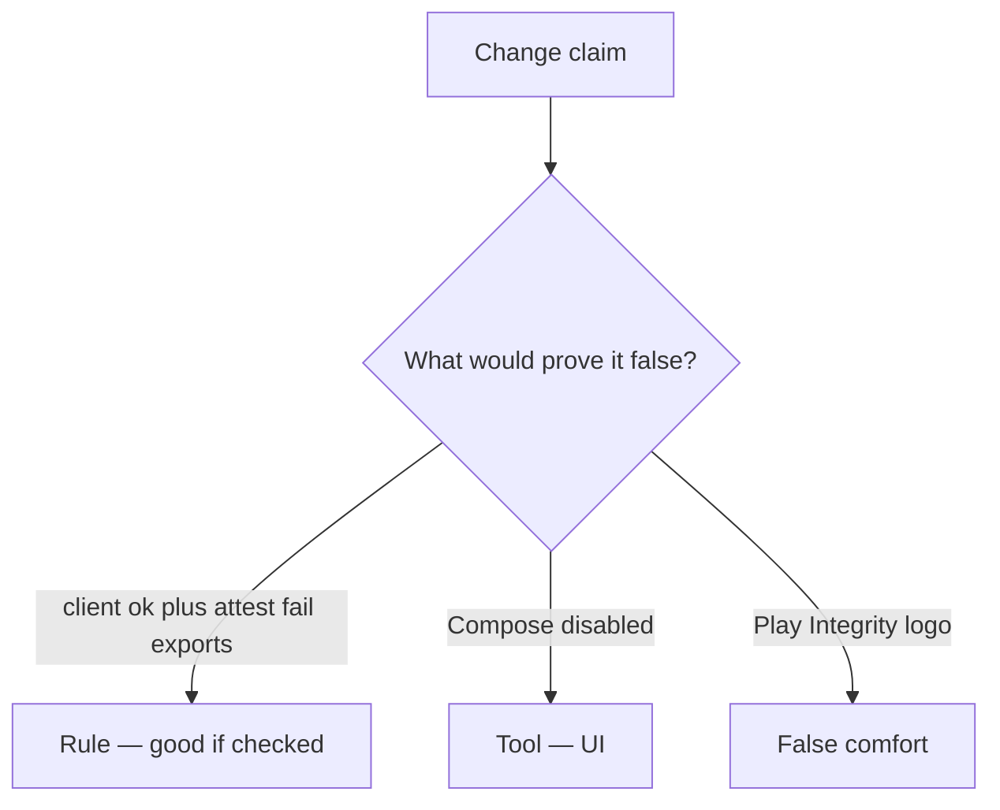

# Review client booleans like a pull request

**Kind:** code-review
**Loop step:** Review

Intended findings live only in the answer-key folder — not here. Do not open that file until your review has been evaluated.

## What you are reviewing

A colleague ships the notes app’s Android export. Review `labs/8.1/8.1-lab/vulnerable/` as that change. Your job is not to count suspicious lines. Reconstruct whether `allow_export({"integrity": "ok"}, "fail")` still returns true, compare that with the rule, and write changes a developer can verify.

The check you already ran (`test_client_integrity_claim_is_not_authorization`) is the rule check. A comment “we will attest later” is not. A sticker about a mobile checklist is not this review.

## Picture: if integrity==ok: export

Start with this seeded smell: **`if integrity==ok: export`**. Label it **rule**, **tool**, or **false comfort** before you accept the change.

Start from what must stay true (client ok plus attest fail denied). Everything that is not a server-attest check at that call is a candidate client-boolean path. A Play Integrity logo without that check is the same problem, not a different kind of finding.

Shrinking the app and a platform-integrity check raise cost; they do not become 1.2. Feature flags and 8.4 debug clients are other hostile-client paths — name them, do not skip `test_client_integrity_claim_is_not_authorization`.

## Seeded smells (label them yourself)

- `if integrity==ok: export`
- No server-attest check
- Secrets in the app file (8.4)
- A mobile checklist used as a sticker / old numbered levels

Also reject: live device farms; personal-phone cookbooks; closing findings without re-running `test_client_integrity_claim_is_not_authorization`; keys in learner notes.

## Common mix-ups this topic refuses

- Shrinking the app is authorization
- Kotlin is the guarantee
- Store listing equals device trust
- Play Integrity in the app is 1.2
- Old numbered mobile levels are current

## Practice

Write three review notes a peer could act on. Each note: what you saw, rule or false comfort, suggested structural change, leftover you will **not** delete. Tie at least one note to `test_client_integrity_claim_is_not_authorization`. Do not open the keys file.

## Use it somewhere new

A clinic change that “enabled Play Integrity” without a failing-attest deny check is an incomplete review. Name the independent falsehood that would still keep client ok plus attest fail false.

## What this page is not doing

Do not merge by adding a comment “will attest later.” That comment is leftover without an owner. Do not instrument a live device to prove the finding.
