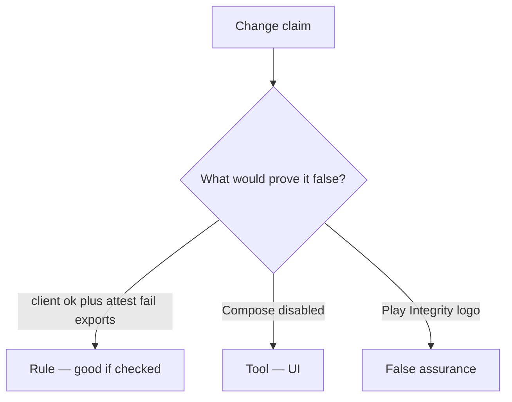

# Would you merge this client booleans?

**Kind:** code-review
**Loop step:** Review

## What you are reviewing

Open `labs/8.1/8.1-lab/vulnerable/` as an Android-export PR. Does `allow_export({"integrity": "ok"}, "fail")` still return true?

Shipping “we will attest later” leaves `test_client_integrity_claim_is_not_authorization` failing. A sticker about a mobile checklist does not make the APK honest.

## Picture: if integrity==ok: export

**`if integrity==ok: export`**.

Client ok plus attest fail still has to be denied. If the change never checks a server attest, that client-boolean path is still open. A Play Integrity logo without that check is still the same problem.

Shrinking the app and a platform-integrity check raise cost; they do not become 1.2. Feature flags and 8.4 debug clients are other hostile-client paths — name them, do not skip `test_client_integrity_claim_is_not_authorization`.

## Problems to find (name them yourself)

- `if integrity==ok: export`
- No server-attest check
- Secrets in the app file (8.4)
- A mobile checklist used as a sticker / old numbered levels

Also reject: live device farms; personal-phone cookbooks; closing findings without re-running `test_client_integrity_claim_is_not_authorization`; keys in learner notes.

## Common mix-ups this topic refuses

- Shrinking the app is authorization
- Kotlin is the guarantee
- Store listing equals device trust
- Play Integrity in the app is 1.2
- Old numbered mobile levels are current

## Use it somewhere new

Enabling Play Integrity without a failing-attest deny still lets the client claim export. Play Integrity is not a failing-attest deny — write the export refuse.

## What this page is not doing

A client `integrity=ok` claim with only “will attest later” still has no owner on the server check. Do not instrument a live device to prove the finding.
