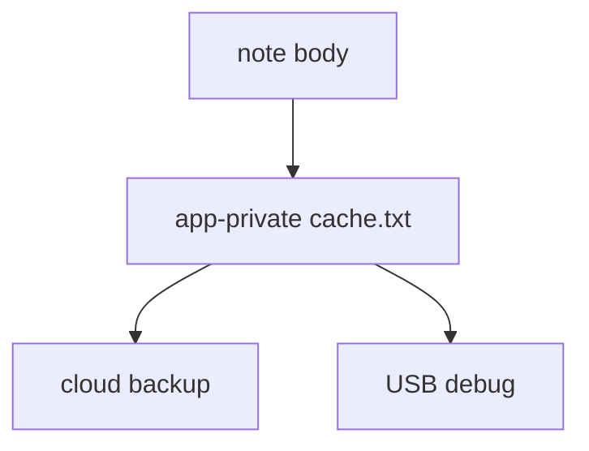
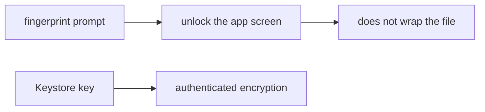

# A private app folder is not encryption

**Kind:** concept-model
**Loop step:** 1 Property

## The rule

The notes app may cache notes so you can read them offline. That cache lives on a **hostile phone** (last topic, 8.1). A world-readable Downloads file is worse. A private app folder is still not encryption. Last crypto topic (5.2) already refused Base64. The grain is **the phone’s disk**.

> After `save_note("secret")`, `plaintext_on_disk()` must be false.

What must not happen: **a note body cached as plaintext on disk**. A stolen USB backup, or a phone whose cache is unlocked, yields the bodies.

Sensitive data stored in a way that is actually secret, not just “in the app folder.” They also want extra copies stopped — screenshots, clipboard, notifications, backups. Keys belong in the platform store (Android Keystore, later iOS Keychain), not next to the file. A fingerprint prompt is **local** unlock. It is not the server second factor from 4.2.

## Picture: private folder versus ciphertext



`MODE_PRIVATE` keeps other *apps* out on a healthy OS. Root, backup agents, and a USB debug backup still see the bytes.

## Picture: fingerprint prompt versus the key



A prompt that shows the list is not wrapping the cache key. A compromised OS can skip the prompt. That leftover stays even when local unlock looks polished.

EncryptedSharedPreferences on *some* prefs, `FLAG_SECURE` alone, and “we use Room” do not keep a cached note from sitting as plaintext on disk.

## Why it happens, what it costs, how you stop it, how you notice, how you recover

| Slice | For this rule |
|---|---|
| Why it happens | Bodies written as text files |
| What's already wrong | `plaintext_on_disk` true after save |
| Trigger | Lost device, backup, USB |
| What it costs | The note bodies are no longer secret on the device |
| How you stop it | Encrypt the cache with keys held in Keystore; expire; wipe on logout or revoke |
| How you notice | Device-lost flow; backup-flag review |
| How you recover | Revoke sessions; rotate |

## What the framework does vs what you still have to check

EncryptedSharedPreferences is not automatic for every file. Room defaults to plaintext SQLite. iOS Data Protection classes are a later mirror — still not “the file is gone.”

A save leaves `plaintext_on_disk()` false — files in `labs/8.2/8.2-lab`. It is local only. It is not a live phone.

## What the tool cannot do

- A fingerprint gates the screen. It does not stop key extraction on a compromised OS.
- Screenshots, recents, clipboard, logs, auto backup, WorkManager extras.
- The lab `aead:` prefix is a **teaching stand-in**, not AES-GCM.

## Can people still use it

Unlock-with-fingerprint must still have a device-PIN fallback people can actually use. Do not dump plaintext onto a debug overlay. Offline “read-only until sync” must still be readable (WCAG 2.2 4.1.3).

## Practice

Inventory every local store. Then run:

```text
python3 -m pytest labs/8.2/8.2-lab/tests --impl vulnerable
python3 -m pytest labs/8.2/8.2-lab/tests --impl fixed
```

## Use it somewhere new

Clinic offline chart cache. iOS Keychain vs Android Keystore. Desktop Electron.

## What this page is not doing

Do not use live device imaging, dumping real AES into lessons. Opening this page does not finish a check-in. Answer keys are not on this site.
