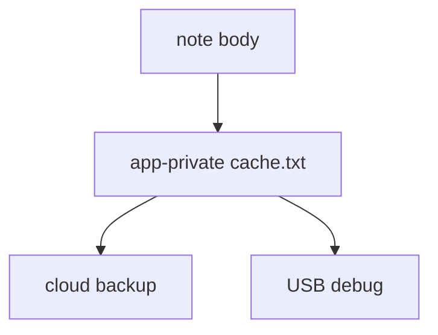
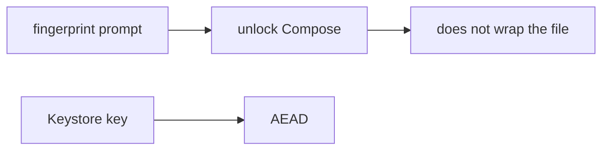

# 8.2-LO-01 — Private app dir is not encryption

**Kind:** concept-model
**Loop step:** 1 Property
**Standards:** OWASP MASVS 2.1.0 (final) `MASVS-STORAGE-1`, `MASVS-STORAGE-2`, `MASVS-CRYPTO-2`, `MASVS-AUTH-2`. MASTG 2.0.0 tests. ASVS `v5.0.0-11.3.3` named; lab prefix is a stand-in.

## The claim this module owns

SecureCollab Android may cache notes for offline read. The cache lives on a **hostile device** (8.1). A world-readable Downloads file is worse, but **internal storage is still not encryption**. Module 5.2 already refused Base64; this module’s grain is **the phone’s disk**.

> After `save_note("secret")`, `plaintext_on_disk()` must be false.

The forbidden outcome is **note body cached as plaintext on disk**. Stolen USB backup or an unlocked-cache device yields bodies.

MASVS-STORAGE-1 wants sensitive data stored securely; STORAGE-2 wants leakage prevented (screenshots, clipboard, notifications, backups). CRYPTO-2 wants keys in platform Keystore/Keychain, not next to the file. AUTH-2 is **local** authentication — it is not 4.2 server MFA.

## Mental model: private dir versus ciphertext



`MODE_PRIVATE` keeps other *apps* out on a healthy OS. Root, backup agents, and `adb backup` still see bytes.

## Mental model: biometric gate versus key



A prompt that shows the list is not wrapping the cache key. Compromised OS can skip the prompt (`MASVS-AUTH-2` residual).

**Mechanism (not the property):** EncryptedSharedPreferences on *some* prefs; `FLAG_SECURE` alone; “we use Room.”

## Root cause vs impact vs prevention vs detection vs recovery

| Slice | For this property |
|---|---|
| Root cause | Bodies written as text files |
| Preconditions | `plaintext_on_disk` true after save |
| Trigger | Lost device, backup, USB |
| Impact | Confidentiality of bodies at rest on the device |
| Prevention | Encrypt cache with Keystore-held keys; expire; wipe on logout/revoke |
| Detection | Device-lost flow; backup-flag review |
| Recovery | Revoke sessions; rotate |

## Framework defaults versus the disk guarantee

EncryptedSharedPreferences is not automatic for every file. Room defaults to plaintext SQLite. iOS Data Protection classes are a later mirror — still not “the file is gone.”

## Mechanism limits

- Biometrics gate UI, not key extraction on a compromised OS.
- Screenshots, recents, clipboard, logs, auto backup, WorkManager extras.
- Lab `aead:` prefix is a **teaching stand-in**, not AES-GCM.

## Usability and accessibility

Unlock-with-biometrics fallback must remain accessible (device credential) without dumping plaintext to a debug overlay. Offline “read-only until sync” must be readable (WCAG 2.2 4.1.3).

## Practice

Inventory every local store. Then run:

```
python3 -m pytest labs/8.2/8.2-lab/tests --impl vulnerable
python3 -m pytest labs/8.2/8.2-lab/tests --impl fixed
```

The first command must fail. The second must pass.

## Transfer

Clinic offline chart cache. iOS Keychain vs Android Keystore. Desktop Electron.

## Non-goals

Live device imaging, dumping real AES into lessons. Gates 0–10 and M0–M5 stay **not-attempted**. Answer keys are not in this file.
