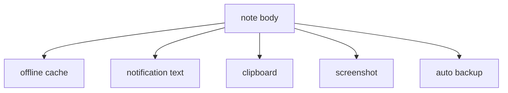
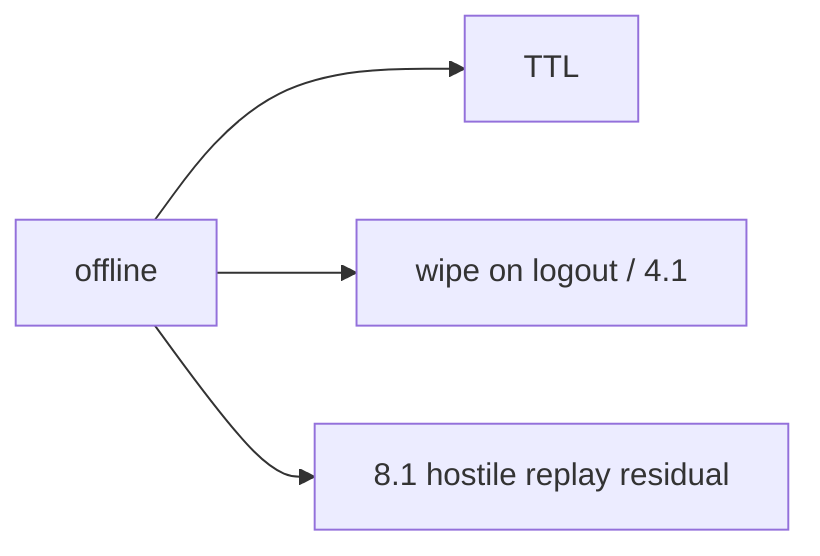

# 8.2-LO-02 — Device store inventory including backups

**Kind:** design-exercise
**Loop step:** 2 Model
**Standards:** OWASP MASVS 2.1.0 (final) `MASVS-STORAGE-1`, `MASVS-STORAGE-2`.

## Can a second engineer name pytest cases from your inventory?

“We use EncryptedSharedPreferences” is not this lesson. A reviewable model names **each store and whether it can hold a body**.

SecureCollab Phase 8 freeze: local `save_note` / `plaintext_on_disk`. No live phones.

## Mental model: many sinks, one body

5.1’s deletion graph now includes the device.

## Mental model: offline still has a policy

## Step 1: freeze pieces

| Piece | This system |
|---|---|
| Subjects | lost-device finder; backup agent; USB |
| Objects | cached note body |
| Actions | `save_note` |
| Channels | app-private files (lab dict stand-in) |
| TCB | ciphertext stand-in + wipe policy |
| Untrusted | the device (8.1) |
| State / time | TTL; logout; restore |
| 1.1 cell | confidentiality at rest on device |

## Step 2: write cells

| Subject | Object | Action | Decision |
|---|---|---|---|
| app | cache | save | ciphertext, not body |
| backup agent | same file | copy | residual unless excluded |
| biometric UI | lock screen | gate | not encryption |
| notification | title | show | no body |

## Practice

Draw the inventory. Point at `labs/8.2/8.2-lab` file `disk.py`.

## Transfer

Clinic chart cache; iOS Keychain classes as a later mirror.

## Residual risk

Extracted Keystore keys on a compromised OS; screenshot channel; 8.3 clipboard IPC.

## Non-goals

Top 10 as the definition of security. Keys stay out of lessons.
