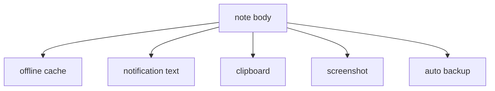
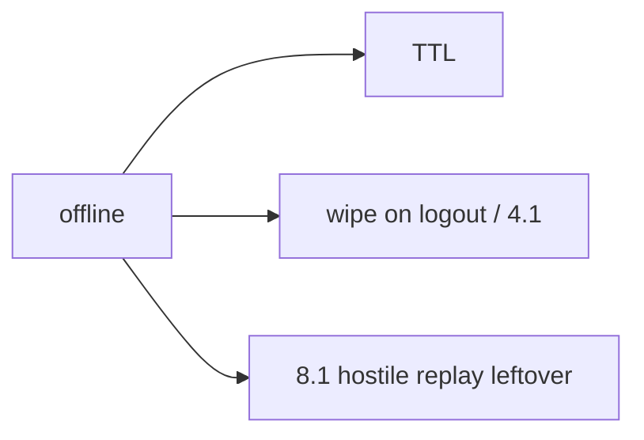

# Device store inventory including backups

**Kind:** design-exercise
**Loop step:** 2 Model

## Could someone else name the checks from your map?

The testable picture is **each store and whether it can hold a body** — not “We use EncryptedSharedPreferences”.

`save_note` / `plaintext_on_disk` — no live phones.

## Picture: many sinks, one body

5.1’s deletion graph now includes the device.

## Picture: offline still has a policy

## Step 1: name the pieces

| Piece | This system |
|---|---|
| Who | Lost-device finder; backup agent; USB |
| What | Cached note body |
| Actions | `save_note` |
| Paths | App-private files (lab dict stand-in) |
| What you trust | Ciphertext stand-in plus wipe policy |
| What you do not trust | The device (8.1) |
| Time | TTL; logout; restore |
| Authorization cell | Secrecy at rest on the device |

## Step 2: write cells the practice can fail

| Who | What | Action | Decision |
|---|---|---|---|
| app | cache | save | ciphertext, not body |
| backup agent | same file | copy | leftover unless excluded |
| fingerprint UI | lock screen | gate | not encryption |
| notification | title | show | no body |

## Practice

Open `disk.py` under `labs/8.2/8.2-lab`. Label the store even in the repaired tree — the fix is the ciphertext stand-in, not pretending a private folder became encryption.

## Use it somewhere new

The chart cache is this grain; iOS Keychain classes are a later mirror.

## What can still go wrong

Extracted Keystore keys on a compromised OS; screenshot channel; 8.3 clipboard IPC.

## What this page is not doing

Answer keys are not on this site.
