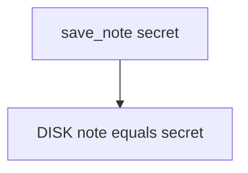

# 8.2-LO-03 — Observe plaintext cache, do not image a personal phone

**Kind:** mechanism-lab
**Loop step:** 3 Break
**Standards:** OWASP MASVS 2.1.0 (final) `MASVS-STORAGE-1`.

## Authorized scope

`labs/8.2/8.2-lab` only. Synthetic body `'secret'`. No live device backups.

**Forbidden outcome:** Note body cached as plaintext on disk.

## Mental model: write the body as the file



The vulnerable tree demonstrates **cause** (text file). Do not dump personal device storage.

## What to read in the fixture

`vulnerable/disk.py` stores the body as-is. Tests require `plaintext_on_disk()` false after save.

## Root cause vs impact

| Slice | Lab |
|---|---|
| Root cause | Bodies written as text |
| Impact | Local confidentiality loss |
| Not the lesson | STORAGE as a sticker |

## Practice

```
python3 -m pytest labs/8.2/8.2-lab/tests --impl vulnerable
```

Record `test_cached_note_is_not_plaintext_on_disk`. Do not image phones.

## Transfer

Clinic chart cache. Predict without leaving this directory.

## Non-goals

No live-target instructions. Synthetic `'secret'` only.
