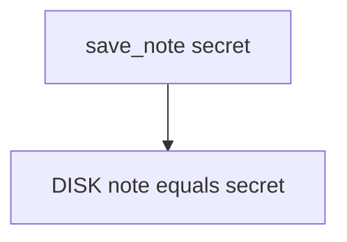

# Practice: a note body cached as plaintext

**Kind:** mechanism-lab
**Loop step:** 3 Break

## Try it

The practice is not a phone you image. It is a tiny Python `save_note` / `plaintext_on_disk`. The failure is already in the function: it stores the body as-is, so after `save_note("secret")` the disk still holds `'secret'`. A **note body cached as plaintext** is **a failed rule**, not a trophy against a personal phone.

The rule under test:

> After `save_note("secret")`, `plaintext_on_disk()` must be false. A private app folder is not encryption.

## Where you may practice

Only `labs/8.2/8.2-lab` is in scope. The helper is an in-process `save_note` / `plaintext_on_disk`. Fake body `'secret'`. It does not open a network. Do not image a live phone, dump a personal backup, or run `adb backup` on a hospital tablet.

Do not paste this exercise onto a public device, employer clinic, or live EHR tablet.

What must not happen: **a note body cached as plaintext on disk**. After `save_note("secret")`, `plaintext_on_disk()` is true.

Who could do this: a stolen USB backup or a phone whose cache is unlocked. That stands in for a clinic “available offline” write of `charts.json`, a Room SQLite dump, or a cloud backup of internal storage. What is supposed to stop this: `save_note` is supposed to leave **ciphertext (or a stand-in) on disk**, not the body. `MODE_PRIVATE`, a fingerprint prompt, and EncryptedSharedPreferences on a *different* file are not enough.

## Picture: write the body as the file



The broken files show **cause** (a text file). Do not dump personal device storage. What has to be true first: `save_note` stores the body as-is. You do not need an emulator. You must not image a phone.

Industry lists ask for sensitive data stored securely. Last crypto topic (5.2) already refused Base64; this rule is **the phone’s disk**. Topic 8.1 already said the device is hostile.

## What to read in the broken files

`vulnerable/disk.py` stores the body as-is. Checks:

- `test_cached_note_is_not_plaintext_on_disk`
- `test_other_body_is_not_reported_as_plaintext_secret` — honest `'other'` must not be reported as the secret

You do not need a new filename. The failure of `test_cached_note_is_not_plaintext_on_disk` *is* the evidence.

Do not open the repaired files yet. Diagnose the cause first.

## Why it happens vs what it costs

| Slice | This practice |
|---|---|
| Required rule | After `save_note("secret")`, `plaintext_on_disk()` is false |
| Why it happens | Bodies written as text files |
| What has to be true first | `DISK['note']` equals the body |
| Trigger | Lost device, backup, USB |
| What it costs | The note bodies are no longer secret on the device |
| How you stop it | Encrypt the cache with keys held in Keystore; expire; wipe on logout or revoke |
| How you notice | Device-lost flow; `backup_flag` review; never the body |
| How you recover | Wipe; revoke sessions; rotate |
| Not the lesson | A storage sticker, live device imaging, or the lab prefix claimed as AES |

## What the framework does vs what you still have to check

EncryptedSharedPreferences is not automatic for every file. Room defaults to plaintext SQLite. `MODE_PRIVATE` keeps other *apps* out on a healthy OS; root, backup agents, and USB still see bytes. What this practice is supposed to show: `plaintext_on_disk()` is false after save.

## Practice

```text
python3 -m pytest labs/8.2/8.2-lab/tests --impl vulnerable
```

Run from `labs/8.2/8.2-lab` if a repo-root collection picks up `site/`. Record `test_cached_note_is_not_plaintext_on_disk`. Do not “fix” the check to pass. The failure *is* the evidence that the rule is currently false. Do not image phones. A setup error is not proof the rule holds.

## Use it somewhere new

Clinic chart cache. Predict without leaving this directory. Do not image a live hospital tablet.

## What this page is not doing

No live-target steps. Fake `'secret'` only. Do not dump real AES into lessons.
