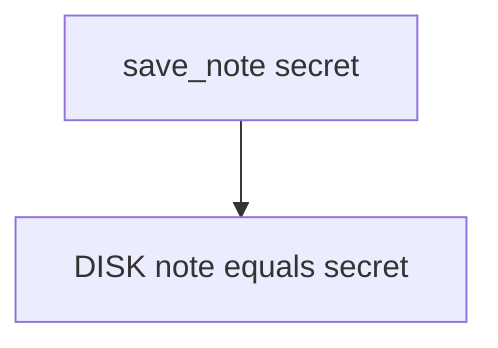

# 8.2-LO-03 — Observe plaintext cache, do not image a personal phone

**Kind:** mechanism-lab
**Loop step:** 3 Break
**Standards:** OWASP MASVS 2.1.0 (final) `MASVS-STORAGE-1`. STORAGE-2 (screenshots, clipboard, backups) is a paired residual. CRYPTO-2 wants keys in Keystore, not next to the file. AUTH-2 is local authentication, not 4.2 server MFA. Do not use MASVS L1/L2/R.

## Authorized scope

`labs/8.2/8.2-lab` only. The fixture is an in-process `save_note` / `plaintext_on_disk`. Synthetic body `'secret'`. No live device backups, no personal-phone imaging, no `adb backup` of a hospital tablet.

**Forbidden outcome:** Note body cached as plaintext on disk. After `save_note("secret")`, `plaintext_on_disk()` is true.

Attacker capability in this lab: stolen USB backup or an unlocked-cache device. That stands in for a clinic “available offline” write of `charts.json`, a Room SQLite dump, or a cloud backup of internal storage. Trust assumption: `save_note` is supposed to leave **ciphertext (or a stand-in) on disk**, not the body. `MODE_PRIVATE`, a fingerprint prompt, and EncryptedSharedPreferences on a *different* file are not in the TCB for this cell.

## Mental model: write the body as the file



The vulnerable tree demonstrates **cause** (text file). Do not dump personal device storage. Preconditions: `save_note` stores the body as-is. You do not need an emulator. You must not image a phone.

MASVS-STORAGE-1 wants sensitive data stored securely. Module 5.2 already refused Base64; this cell is **the phone’s disk**. Module 8.1 already said the device is hostile.

## What to read in the fixture

`vulnerable/disk.py` stores the body as-is. Tests:

- `test_cached_note_is_not_plaintext_on_disk`
- `test_other_body_is_not_reported_as_plaintext_secret` — honest `'other'` must not be reported as the secret

You do not need a new filename. The failure of `test_cached_note_is_not_plaintext_on_disk` *is* the evidence.

Do not open the fixed tree yet. Diagnose the cause first.

## Root cause vs impact vs prevention vs detection vs recovery

| Slice | This lab |
|---|---|
| Required property | After `save_note("secret")`, `plaintext_on_disk()` is false |
| Root cause | Bodies written as text files |
| Preconditions | `DISK['note']` equals the body |
| Trigger | Lost device, backup, USB |
| Impact | Confidentiality of bodies at rest on the device |
| Prevention | Encrypt cache with Keystore-held keys; expire; wipe on logout/revoke |
| Detection | Device-lost flow; `backup_flag` review; never the body |
| Recovery | Wipe; revoke sessions; rotate |
| Not the lesson | STORAGE as a sticker; live device imaging; lab prefix claimed as AES |

## Framework defaults versus the disk guarantee

EncryptedSharedPreferences is not automatic for every file. Room defaults to plaintext SQLite. `MODE_PRIVATE` keeps other *apps* out on a healthy OS; root, backup agents, and USB still see bytes. The application guarantee is: **this** fixture, `plaintext_on_disk()` is false after save.

## Practice

```text
python3 -m pytest labs/8.2/8.2-lab/tests --impl vulnerable
```

Run from `labs/8.2/8.2-lab` if a repo-root collection picks up `site/`. Record `test_cached_note_is_not_plaintext_on_disk`. Do not image phones. An environment error is not security evidence.

## Transfer

Clinic chart cache. Predict without leaving this directory. Do not image a live hospital tablet.

## Non-goals

No live-target instructions. Synthetic `'secret'` only. Do not dump real AES into lessons.
