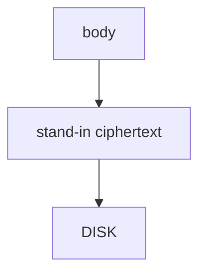

# Store a ciphertext stand-in, not the body

**Kind:** design-exercise
**Loop step:** 4 Build

## The rule

A private folder does not hide the note. A fingerprint prompt does not hide it. EncryptedSharedPreferences on a *different* file still leaves `'secret'` on disk.

Do this: the stored bytes are **not the body**. `save_note` must not write `'secret'` as the file contents. Store a ciphertext stand-in, not the body.

The lab uses an `aead:` prefix plus length as a **stand-in** for Keystore-wrapped authenticated encryption — not a real cipher (5.2). Here: that wrap.

The check in the notes app’s offline cache: `plaintext_on_disk()` false after save. If wrap fails, **do not** fall back to plaintext. That still denies — even if Keystore was locked.

## Picture: wrap then write



The cache writes `'aead:'` plus length, never the body. Android Keystore plus real authenticated encryption is still required; iOS Keychain is a later mirror. A fingerprint gates the screen. It does not stop key extraction on a compromised OS. Screenshots, recents, clipboard, logs, auto backup, and WorkManager extras remain extra copies.

That secure store has to be implemented — `'secret'` on disk.

## What the repaired files must show

| After the fix | Must be true |
|---|---|
| save `'secret'` | `plaintext_on_disk` false |
| save `'other'` | `plaintext_on_disk` false |

In doubt, if wrap fails, **do not store the body**. Do not keep a text-file cache because “the folder is private.”

## What this is not

- `MODE_PRIVATE` alone.
- A fingerprint prompt alone.
- EncryptedSharedPreferences for a *different* file.
- Base64 (5.2).
- Room `insert` success.
- `FLAG_SECURE` as the disk wrap.

## What the tool cannot do

- A fingerprint gates the screen. It does not stop key extraction on a compromised OS.
- Screenshots, recents, clipboard, logs, auto backup, WorkManager extras.
- The lab `aead:` prefix is a **teaching stand-in**, not AES-GCM.
- 4.1 wipe on logout is still required.
- Extracted keys plus ciphertext backups remain.

## Practice

Name the predicate (stored bytes ≠ body; no plaintext fallback). Run:

```text
python3 -m pytest labs/8.2/8.2-lab/tests --impl fixed
```

## Use it somewhere new

Stop treating “internal storage” as the chart-cache control.

## What can still go wrong

Backups of ciphertext with extracted keys; screenshots; notifications; 4.1 wipe on logout; clipboard (8.3); the lab prefix is not AES.

## What this page is not doing

Do not image a phone. Do not claim Gate 8 from a fingerprint screenshot.
