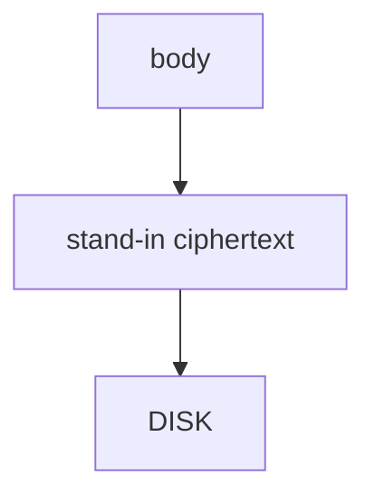

# 8.2-LO-04 — Store a ciphertext stand-in, not the body

**Kind:** design-exercise
**Loop step:** 4 Build
**Standards:** OWASP MASVS 2.1.0 (final) `MASVS-STORAGE-1`, `MASVS-CRYPTO-2`.

## Structural means the stored bytes are not the body

`save_note` must not write `'secret'` as the file contents. The lab uses an `aead:` prefix plus length as a **stand-in** for Keystore-wrapped AEAD — not a real cipher (5.2).

## Mental model: wrap then write



Production: Android Keystore key + AEAD; iOS Keychain later. Fail-safe: if wrap fails, **do not** fall back to plaintext.

## Why this restores the cell

| After the fix | Must be true |
|---|---|
| save `'secret'` | `plaintext_on_disk` false |
| save `'other'` | `plaintext_on_disk` false |

## What this is not

`MODE_PRIVATE` alone. Biometric prompt alone. EncryptedSharedPreferences for a *different* file. Base64 (5.2).

## Practice

Name the predicate. Run:

```
python3 -m pytest labs/8.2/8.2-lab/tests --impl fixed
```

Must pass.

## Transfer

Clinic: stop treating “internal storage” as the chart-cache control.

## Residual risk

Backups of ciphertext with extracted keys; screenshots; notifications; 4.1 wipe on logout still required.
