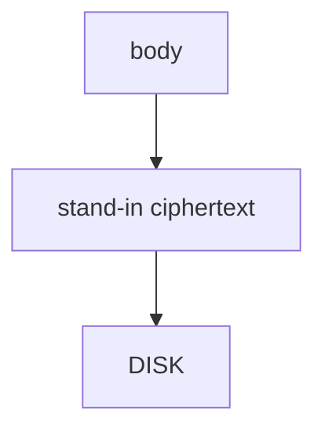

# 8.2-LO-04 — Store a ciphertext stand-in, not the body

**Kind:** design-exercise
**Loop step:** 4 Build
**Standards:** OWASP MASVS 2.1.0 (final) `MASVS-STORAGE-1`, `MASVS-CRYPTO-2`. AUTH-2 is local, not 4.2. ASVS `v5.0.0-11.3.3` is named; the lab prefix is a stand-in.

## Structural means the stored bytes are not the body

`save_note` must not write `'secret'` as the file contents. The lab uses an `aead:` prefix plus length as a **stand-in** for Keystore-wrapped AEAD — not a real cipher (5.2). Structural means that wrap — not `MODE_PRIVATE`, not a fingerprint prompt, not EncryptedSharedPreferences on a different file.

The smallest restore for SecureCollab offline cache is: `plaintext_on_disk()` false after save. Fail-safe: if wrap fails, **do not** fall back to plaintext. Do not fail open because Keystore was locked.

## Mental model: wrap then write



The lab’s fixed tree writes `'aead:'` plus length, never the body. Production: Android Keystore key + AEAD; iOS Keychain later. Biometrics gate UI, not key extraction on a compromised OS (`MASVS-AUTH-2` residual). Screenshots, recents, clipboard, logs, auto backup, and WorkManager extras remain STORAGE-2 residuals.

MASVS-STORAGE-1 wants that secure store implemented. This pytest is that sentence for `'secret'` on disk.

## Why this restores the cell

| After the fix | Must be true |
|---|---|
| save `'secret'` | `plaintext_on_disk` false |
| save `'other'` | `plaintext_on_disk` false |

## What this is not

`MODE_PRIVATE` alone. Biometric prompt alone. EncryptedSharedPreferences for a *different* file. Base64 (5.2). Room `insert` success. FLAG_SECURE as the disk wrap.

## Mechanism limits

- Biometrics gate UI, not key extraction on a compromised OS.
- Screenshots, recents, clipboard, logs, auto backup, WorkManager extras (STORAGE-2).
- Lab `aead:` prefix is a **teaching stand-in**, not AES-GCM.
- 4.1 wipe on logout still required.
- Extracted keys plus ciphertext backups remain.

## Practice

Name the predicate (stored bytes ≠ body; no plaintext fallback). Run:

```text
python3 -m pytest labs/8.2/8.2-lab/tests --impl fixed
```

Must pass. Run from the lab directory if collection at repo root is polluted.

## Transfer

Clinic: stop treating “internal storage” as the chart-cache control.

## Residual risk

Backups of ciphertext with extracted keys; screenshots; notifications; 4.1 wipe on logout; clipboard (8.3); lab prefix is not AES.

## Non-goals

Do not image a phone. Do not claim Gate 8 from a fingerprint screenshot. Do not teach MASVS L1/L2/R as current levels.
