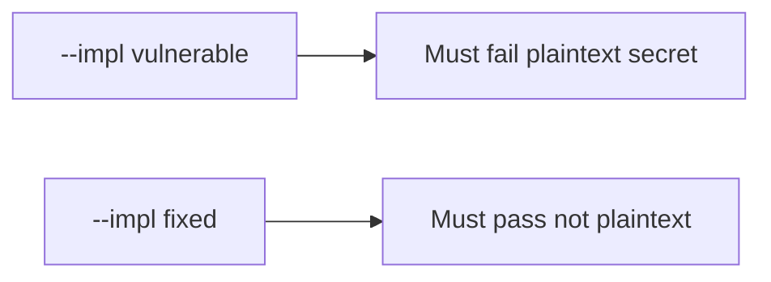

# The broken files must fail when the secret is in plaintext

**Kind:** verification-lab
**Loop step:** 5 Verify

## Check it

“EncryptedSharedPreferences is on” is not evidence. “Internal storage” is a tool observation. The check is: after `save_note("secret")`, `plaintext_on_disk()` is false. That observation must be **false** on `--impl vulnerable` (DISK holds `'secret'`) and **true** on `--impl fixed`. Do not image phones.

## Picture: broken files must fail: plaintext secret

A check that only counts passing cases can still look green while the cache still holds `'secret'`.



If both pass, the check is not looking at the body on disk. If both fail, the fix is not structural or the check is wrong.

## Observations, even for a cache

| Mode | Must show for this topic |
|---|---|
| Wrong input / abuse | save `'secret'` → not plaintext; broken files must fail |
| Normal | save `'other'` → not reported as plaintext secret (may pass on both) |
| Not claimed | Real AES; backup exclusion; screenshot `FLAG_SECURE`; Keystore hardware |

The checks live in `labs/8.2/8.2-lab/tests/test_property.py`. `test_cached_note_is_not_plaintext_on_disk` is there so a text-file cache of `'secret'` cannot sneak through.

```text
python3 -m pytest labs/8.2/8.2-lab/tests --impl vulnerable
python3 -m pytest labs/8.2/8.2-lab/tests --impl fixed
```

Honest `'other'` saves may pass on both implementations. That does not excuse the plaintext-secret deny check. If the broken files do not fail `test_cached_note_is_not_plaintext_on_disk`, the practice is miswired — fix the wiring, not the check.

## What the checks do not prove

- Keystore hardware backing
- Auto-backup exclusion
- Screenshot / notification channels
- iOS Data Protection (later mirror)
- That the lab `aead:` prefix is AES-GCM (it is a stand-in)
- 4.1 logout wipe of the store

## Practice

Run both implementations this session from the lab directory if needed. Write the fail/pass pair next to the notes for this topic. Reject a “check” that only greps `EncryptedSharedPreferences` without calling `save_note("secret")` then `plaintext_on_disk()`. A setup error is not proof the rule holds.

## Use it somewhere new

A clinic example: a test that only asserts Room `insert` succeeded is not this rule. Personal-phone imaging is out of scope.

## What this page is not doing

Do not treat a live backup screenshot as proof. Do not log note bodies. Answer keys are not on this site. Do not claim the lab prefix is AES.
