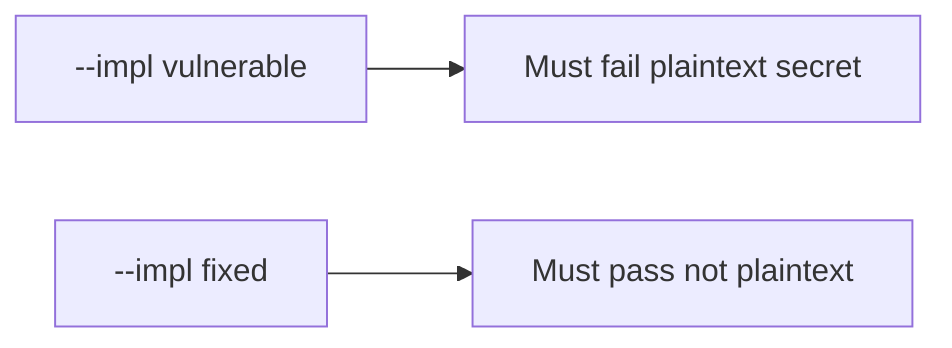

# Fail on the broken files, then pass on the repaired ones

**Kind:** verification-lab
**Loop step:** 5 Verify

## If you cannot test it, it is still a slogan

“EncryptedSharedPreferences is on” is not evidence. “Internal storage” is a tool observation. The check is: after `save_note("secret")`, `plaintext_on_disk()` is false. That observation must be **false** on `--impl vulnerable` (DISK holds `'secret'`) and **true** on `--impl fixed`. Do not image phones.

## Picture: broken files must fail: plaintext secret

A check that only counts passing cases can pass while the cache still holds `'secret'`. This check asks whether a text-file cache of `'secret'` still counts as a passing control. Broken must fail that question. Repaired must pass it.



If both pass, the check is not looking at the body on disk. If both fail, the fix is not structural or the check is wrong.

## Observations, even for a cache

| Mode | Must show for this topic |
|---|---|
| Wrong input / abuse | save `'secret'` → not plaintext; broken files must fail |
| Normal | save `'other'` → not reported as plaintext secret (may pass on both) |
| Not claimed | Real AES; backup exclusion; screenshot `FLAG_SECURE`; Keystore hardware |

Practice checks live in `labs/8.2/8.2-lab/tests/test_property.py`. `test_cached_note_is_not_plaintext_on_disk` is a **what-must-not-happen** check: a text-file cache of `'secret'` is not allowed to count as a passing control.

```text
python3 -m pytest labs/8.2/8.2-lab/tests --impl vulnerable
python3 -m pytest labs/8.2/8.2-lab/tests --impl fixed
```

Honest `'other'` saves may pass on both implementations. That does not excuse the plaintext-secret deny check. If the broken files do not fail `test_cached_note_is_not_plaintext_on_disk`, the practice is miswired — fix the wiring, not the check.

## What the checks do not prove

- Keystore hardware backing
- Auto-backup exclusion
- Screenshot / notification channels
- iOS Data Protection (later mirror)
- That the lab `aead:` prefix is AES-GCM (it is a stand-in)
- 4.1 logout wipe of the store

Record those as leftover risk or later topics, not as silent passes.

## Practice

Run both implementations this session from the lab directory if needed. Write the fail/pass pair next to the map-page row. Reject a “check” that only greps `EncryptedSharedPreferences` without calling `save_note("secret")` then `plaintext_on_disk()`. An environment error is not security evidence.

## Use it somewhere new

Clinic: a test that only asserts Room `insert` succeeded is not this cell. Personal-phone imaging is out of scope.

## What this page is not doing

Do not add a live backup trophy. Do not log note bodies. Answer keys stay out of this file. Do not claim the lab prefix is AES.
