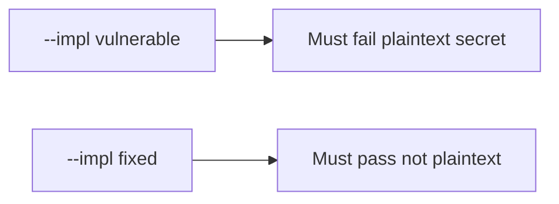

# 8.2-LO-05 — Evidence is plaintext false, then a passing pair

**Kind:** verification-lab
**Loop step:** 5 Verify
**Standards:** OWASP MASVS 2.1.0 (final) `MASVS-STORAGE-1`.

## An invariant that cannot fail a test is still a slogan

“EncryptedSharedPreferences is on” is not evidence. The oracle is the local pair. Do not image phones.

## Mental model: fail-on-vulnerable, pass-on-fixed



| Case | Must show |
|---|---|
| Negative / abuse | save `'secret'` → not plaintext |
| Normal | save `'other'` → not reported as plaintext secret |
| Not claimed | real AES; backup exclusion; screenshot FLAG_SECURE |

```
python3 -m pytest labs/8.2/8.2-lab/tests --impl vulnerable
python3 -m pytest labs/8.2/8.2-lab/tests --impl fixed
```

Honest non-secret saves may pass on both.

## What the tests do not prove

- Keystore hardware backing
- Auto-backup exclusion
- Screenshot / notification channels
- iOS Data Protection

## Practice

Execute both implementations. Map each test to an LO-02 cell.

## Transfer

Clinic: a test that only asserts Room `insert` succeeded is not this cell.
