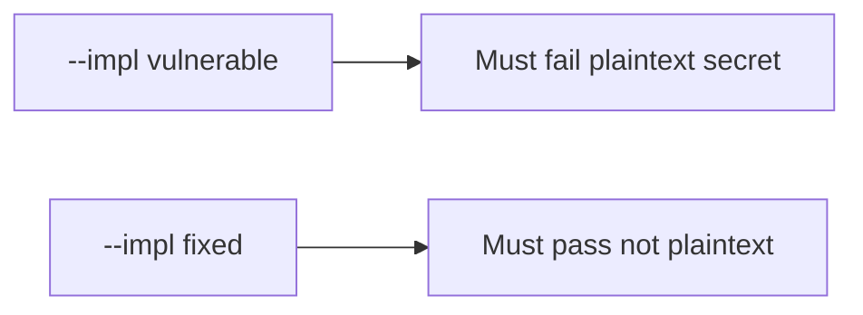

# 8.2-LO-05 — Evidence is plaintext false, then a passing pair

**Kind:** verification-lab
**Loop step:** 5 Verify
**Standards:** OWASP MASVS 2.1.0 (final) `MASVS-STORAGE-1`.

## An invariant that cannot fail a test is still a slogan

“EncryptedSharedPreferences is on” is not evidence. “Internal storage” is a mechanism observation. The oracle is: after `save_note("secret")`, `plaintext_on_disk()` is false. The plaintext-secret observation must be **false** on `--impl vulnerable` (DISK holds `'secret'`) and **true** on `--impl fixed`. Do not image phones.

## Mental model: vulnerable must fail: plaintext secret

The failing observation on `--impl vulnerable` is **plaintext secret**. A passing collection count is not this cell.



| Mode | Must show for this module |
|---|---|
| Negative / abuse | save `'secret'` → not plaintext; vulnerable must fail |
| Normal | save `'other'` → not reported as plaintext secret (may pass on both) |
| Not claimed | real AES; backup exclusion; screenshot FLAG_SECURE; Keystore hardware |

Lab tests in `labs/8.2/8.2-lab/tests/test_property.py`. `test_cached_note_is_not_plaintext_on_disk` is a **forbidden-outcome** test: a text-file cache of `'secret'` is not allowed to count as a passing control.

```text
python3 -m pytest labs/8.2/8.2-lab/tests --impl vulnerable
python3 -m pytest labs/8.2/8.2-lab/tests --impl fixed
```

Honest `'other'` saves may pass on both implementations. That does not excuse the plaintext-secret deny test. If vulnerable does not fail `test_cached_note_is_not_plaintext_on_disk`, the lab is miswired—fix the wiring, not the assertion.

## What the tests do not prove

- Keystore hardware backing
- Auto-backup exclusion (STORAGE-2)
- Screenshot / notification channels
- iOS Data Protection (later mirror)
- That the lab `aead:` prefix is AES-GCM (it is a stand-in)
- 4.1 logout wipe of the store

Record those as residuals or later modules, not as silent passes.

## Practice

Execute both implementations this session from the lab directory if needed. Write the fail/pass pair next to the matrix row. Reject a “test” that only greps `EncryptedSharedPreferences` without calling `save_note("secret")` then `plaintext_on_disk()`.

## Transfer

Clinic: a test that only asserts Room `insert` succeeded is not this cell. Personal-phone imaging is out of scope.

## Non-goals

Do not add a live backup trophy. Do not log note bodies. Keys stay out of this file. Do not claim the lab prefix is AES.
