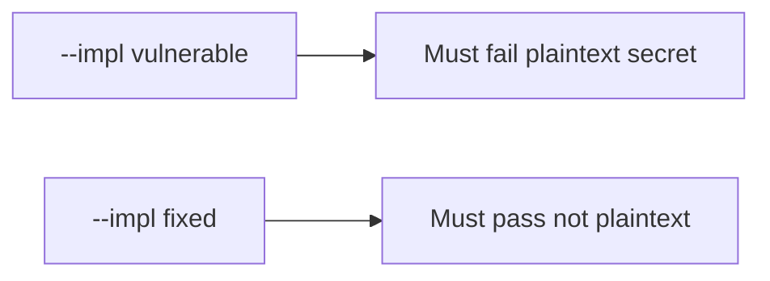

# The broken files must fail when the secret is in plaintext

**Kind:** verification-lab
**Loop step:** 5 Verify

## Check it

EncryptedSharedPreferences on a different file does not hide the note. Internal storage is a folder. After `save_note("secret")`, `plaintext_on_disk()` has to be false. Broken: DISK still holds `'secret'`. Repair leaves DISK empty of `'secret'`. Do not image phones.

## Picture: broken files must fail: plaintext secret

The cache can still hold `'secret'` even when the suite is green.



If the broken cache still passes, the body on disk was never the leftover.

## Observations, even for a cache

| Mode | Must show for this topic |
|---|---|
| Wrong input / abuse | save `'secret'` → not plaintext; broken files must fail |
| Normal | save `'other'` → not reported as plaintext secret (may pass on both) |
| Not claimed | Real AES; backup exclusion; screenshot `FLAG_SECURE`; Keystore hardware |

A text-file cache of `'secret'` is what `test_cached_note_is_not_plaintext_on_disk` watches in `labs/8.2/8.2-lab/tests/test_property.py`.

```text
python3 -m pytest labs/8.2/8.2-lab/tests --impl vulnerable
python3 -m pytest labs/8.2/8.2-lab/tests --impl fixed
```

Saving a non-secret `'other'` value may stay allowed. Keep the cached note off plaintext disk. If the broken files do not fail `test_cached_note_is_not_plaintext_on_disk`, the practice is miswired — fix the wiring, not the check.

## What the checks do not prove

- Keystore hardware backing
- Auto-backup exclusion
- Screenshot / notification channels
- iOS Data Protection (later mirror)
- That the lab `aead:` prefix is AES-GCM (it is a stand-in)
- 4.1 logout wipe of the store

## Practice

Call `save_note("secret")` then `plaintext_on_disk()`. EncryptedSharedPreferences on another file is not this disk. A setup error is not proof the rule holds.

## Use it somewhere new

A Room `insert` that succeeded is the write, not plaintext-off-disk. Do not image a personal phone.

## What this page is not doing

A live backup screenshot is not plaintext-off-disk. Do not log note bodies. Answer keys are not on this site. Do not claim the lab prefix is AES.
