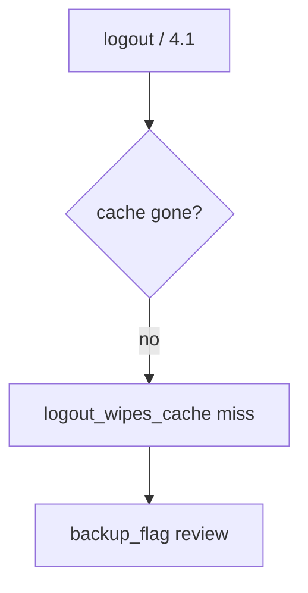

# 8.2-LO-06 — Detect logout_wipes_cache without logging the body

**Kind:** operations-exercise
**Loop step:** 6 Operate
**Standards:** NIST CSF 2.0 (final) DE/RS/RC as outcome labels; MASVS 2.1.0 (final) `MASVS-STORAGE-2`. STORAGE-1 is the wrap; STORAGE-2 is leakage after wrap. Do not use MASVS L1/L2/R.

## Prevention is not absolute

A new WorkManager blob can skip the cache wrapper after `save_note` was “fixed once.” Pair detect and recover. Do not log note bodies (3.1). Do not attach the chart to the ticket.

## Mental model: leftover cache is a signal



| Outcome | This module |
|---|---|
| Detect | `logout_wipes_cache`; `backup_flag` |
| Signal | subject id, store name; never the body |
| Recover | Wipe; revoke sessions; exclude backup |
| Residual | Extracted keys; screenshots; clipboard; notifications |

CSF 2.0 Detect / Respond / Recover name outcomes. They do not prove `MASVS-STORAGE-1`. An MDM product name is not the property. Re-run `test_cached_note_is_not_plaintext_on_disk` after any cache-path change; a green “internal storage” tile is not that pytest. Screenshots, recents, and notification text are other copies of the same body — inventory them before claiming Recover.

## Framework defaults versus the operate guarantee

Android Auto Backup can copy ciphertext *and* a poorly stored key while the pytest still says “not plaintext secret.” Detection must observe **`plaintext_on_disk()` false**, not a fingerprint prompt. If the alert includes note bodies, you have opened a 3.1 / 5.1 cell.

## Practice

Write one log line you would accept. Tie it to `labs/8.2/8.2-lab`.

```text
log_denied reason=plaintext_cache_forbidden store=offline_notes request_id=req_82e
```

Reject any line that includes note bodies or a live `adb backup` of a personal phone.

## Transfer

Clinic: detect leftover chart cache after logout on a local fixture; do not attach the chart to the ticket. Do not image a live tablet.

## Usability

Unlock-with-biometrics fallback must remain accessible (device credential) without dumping plaintext to a debug overlay. Offline “read-only until sync” must be readable (WCAG 2.2 Success Criterion 4.1.3).

## Non-goals

An MDM product name is not the property. Personal-phone imaging is out of scope. Gates 0–10 stay not-attempted.
