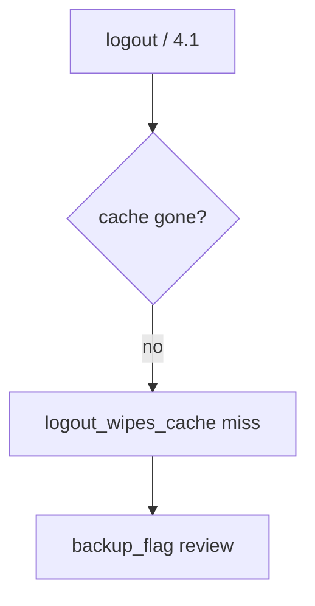

# Wipe the cache without logging the note

**Kind:** operations-exercise
**Loop step:** 6 Operate

## Fixing it once is not enough

A new WorkManager blob can skip the cache wrapper after `save_note` was repaired once. Do not log note bodies (3.1). Leave the chart off the ticket.

## Picture: leftover cache is a signal



A checklist name does not prove the wrap.

## Signals that do not become a second leak

| Outcome | This topic |
|---|---|
| Notice | `logout_wipes_cache`; `backup_flag` |
| What the line holds | subject id, store name; never the body |
| Recover | Wipe; revoke sessions; exclude backup |
| Leftover | Extracted keys; screenshots; clipboard; notifications |

An MDM product name is not the check. Re-run `test_cached_note_is_not_plaintext_on_disk` after any cache-path change. Internal storage does not encrypt the cached note. Screenshots, recents, and notification text are other copies of the same body — list those before you call the disk clean.

## What the framework does vs what you still have to check

Android Auto Backup can copy ciphertext *and* a poorly stored key while the check still says “not plaintext secret.” Notice must observe **`plaintext_on_disk()` false**, not a fingerprint prompt. If the alert includes note bodies, you have opened a logging leak (3.1 / 5.1).

Leftover-cache signals fire without the body.

## Practice

```text
log_denied reason=plaintext_cache_forbidden store=offline_notes request_id=req_82e
```

Reject any line that includes note bodies or a live `adb backup` of a personal phone.

## Use it somewhere new

Notice leftover chart cache after logout on a local helper; do not attach the chart to the ticket. Do not image a live tablet.

## Can people still use it

Unlock-with-fingerprint must still have a device-PIN fallback people can actually use. Do not dump plaintext onto a debug overlay. Offline “read-only until sync” must still be readable (WCAG 2.2 4.1.3).

## What this page is not doing

An MDM product name is not the check. Do not image a personal phone. Opening this page does not finish a check-in.
