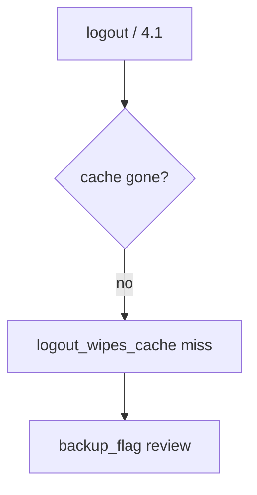

# 8.2-LO-06 — Detect logout_wipes_cache without logging the body

**Kind:** operations-exercise
**Loop step:** 6 Operate
**Standards:** NIST CSF 2.0 (final) DE/RS/RC as outcome labels; MASVS 2.1.0 `MASVS-STORAGE-2`.

## Prevention is not absolute

A new WorkManager blob can skip the cache wrapper. Pair detect and recover. Do not log note bodies (3.1).

## Mental model: leftover cache is a signal



| Outcome | This module |
|---|---|
| Detect | `logout_wipes_cache`; `backup_flag` |
| Signal | subject id, store name; never the body |
| Recover | Wipe; revoke sessions; exclude backup |
| Residual | Extracted keys; screenshots |

## Practice

Write one log line you would accept. Tie it to `labs/8.2/8.2-lab`.

```
log_denied reason=plaintext_cache_forbidden store=offline_notes request_id=req_82e
```

Reject any line that includes note bodies or a live `adb backup` of a personal phone.

## Transfer

Clinic: detect leftover chart cache after logout; do not attach the chart to the ticket.

## Non-goals

An MDM product name is not the property.
