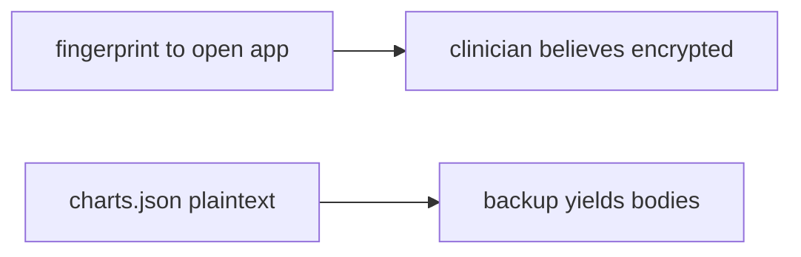

# 8.2-LO-07 — Transfer: clinic offline chart cache

**Kind:** transfer-challenge
**Loop step:** 7 Transfer
**Standards:** OWASP MASVS 2.1.0 (final) `MASVS-STORAGE-1`. AUTH-2 local vs 4.2 server. CRYPTO-2 Keystore. Do not use MASVS L1/L2/R.

## Change the workplace; keep ciphertext on disk

Do not answer with a Top 10 / CWE / scanner as the definition of security. The SecureCollab sentence was: after `save_note("secret")`, `plaintext_on_disk()` must be false. Rewrite it for a clinic without changing the fork.

**Prompt:** Clinic offline chart cache. Also name iOS Keychain vs Android Keystore and desktop Electron.

**Product sketch:** EHR-lite “available offline” that writes the chart as `charts.json` in internal storage, plus a fingerprint prompt to open the app.

Rewrite the SecureCollab sentence. Include:

1. attacker capabilities (lost clinic tablet / backup — not a live hospital);
2. trust assumptions (Keystore-wrapped cache is TCB; private dir and fingerprint UI are not);
3. forbidden outcome (`plaintext_on_disk` true, not “HIPAA”);
4. a test idea on a **local** fixture only (no personal-phone imaging);
5. residual (backups, screenshots, notifications, extracted keys, clipboard);
6. WCAG if a human unlock path exists (device-credential fallback, no plaintext debug overlay).

Use synthetic labels. Do not use real patient charts.

## Mental model: fingerprint is not the file wrap

If “available offline” writes `charts.json` while a fingerprint prompt unlocks Compose, the cell is gone. `MODE_PRIVATE`, Room, and AUTH-2 local biometrics do not wrap the file. iOS Keychain vs Android Keystore and desktop Electron are the same disk family — name them, do not image those devices here. The lab `aead:` prefix is a stand-in, not AES.

The clinic rewrite still has to keep the SecureCollab fork: `'secret'` not on disk after save. Storing charts internally with a fingerprint lock without a plaintext-on-disk test leaves `plaintext_on_disk()` true. The local pytest analogue is `test_cached_note_is_not_plaintext_on_disk` — on a fixture, not a live tablet image.

## What graders reject

| Reject | Why |
|---|---|
| “Internal storage” | Not encryption |
| Live clinic tablet imaging | Lab policy |
| “Fingerprint is MFA” | AUTH-2 local, not 4.2 |
| EncryptedSharedPreferences on another file | Wrong store |
| Room insert as this cell | Wrong observation |

## Practice

One page. No keys. `labs/8.2/8.2-lab` is the only running system you may break. Do not image a public or personal device.

## Non-goals

Live-target device forensics. Real charts. Claiming Gate 8 from this page.
