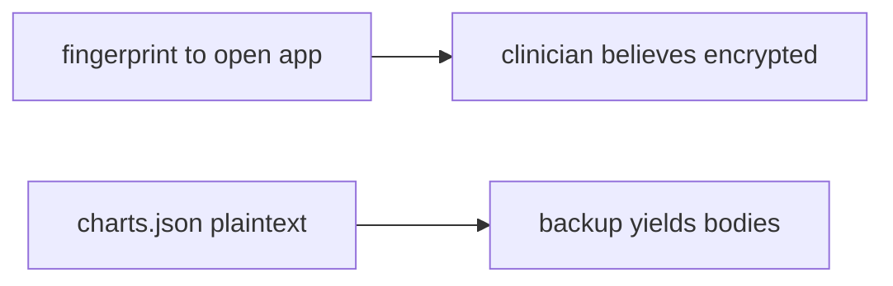

# Same idea on a clinic offline chart cache

**Kind:** transfer-challenge
**Loop step:** 7 Transfer

## Use it somewhere new

You get a clinic offline chart cache. Also name iOS Keychain vs Android Keystore and desktop Electron.

Do not answer with a famous-bugs list, a CWE, or a scanner as the definition of security. The notes-app sentence was: after `save_note("secret")`, `plaintext_on_disk()` must be false. Rewrite it for a clinic.

**Product sketch:** an EHR-lite “available offline” that writes the chart as `charts.json` in internal storage, plus a fingerprint prompt to open the app.

## Picture: fingerprint is not the file wrap

Renaming `save_note` to `save_chart` is not transfer. Person, object, path, and leftover change. If “available offline” writes `charts.json` while a fingerprint prompt unlocks the app screen, the rule is gone. `MODE_PRIVATE`, Room, and a local fingerprint do not wrap the file. iOS Keychain vs Android Keystore and desktop Electron are the same disk family — name them, do not image those devices here. The lab `aead:` prefix is a stand-in, not AES.

| Notes app this week | Clinic sketch |
|---|---|
| Lost-device finder / USB backup | Lost clinic tablet / backup — not a live hospital |
| `save_note("secret")` then `plaintext_on_disk()` | Clinic chart cache on disk |
| Ciphertext stand-in is what you trust | Same; private folder and fingerprint UI are not |
| iOS / Electron leftover | Keychain classes and desktop files — name them, do not image them here |

## Prompt — clinic offline chart cache

Rewrite the notes-app sentence for this product. Your answer must include:

1. who can act (lost clinic tablet / backup — not a live hospital);
2. what you trust (Keystore-wrapped cache is what you trust; private folder and fingerprint UI are not);
3. what must not happen (`plaintext_on_disk` true, not “HIPAA”);
4. a check idea on **local** practice files only (no personal-phone imaging);
5. leftover risk (backups, screenshots, notifications, extracted keys, clipboard);
6. the web accessibility baseline if a human unlock path exists (device-PIN fallback, no plaintext debug overlay).

Use fake labels. Do not use real patient charts.

`'secret'` still has to be off disk after save. Storing charts internally with a fingerprint lock without a plaintext-on-disk check leaves `plaintext_on_disk()` true. The local check is `test_cached_note_is_not_plaintext_on_disk` — on the practice files, not a live tablet image.

## What is not good enough

| Reject | Why |
|---|---|
| “Internal storage” | Not encryption |
| Live clinic tablet imaging | Course rules |
| “Fingerprint is MFA” | Local unlock, not 4.2 |
| EncryptedSharedPreferences on another file | Wrong store |
| Room insert as this rule | Wrong observation |

## Practice

One page. No keys. `labs/8.2/8.2-lab` is the only running system you may break. Do not image a public or personal device.

## What this page is not doing

Live-target device forensics. Real charts. This page does not finish a check-in.
