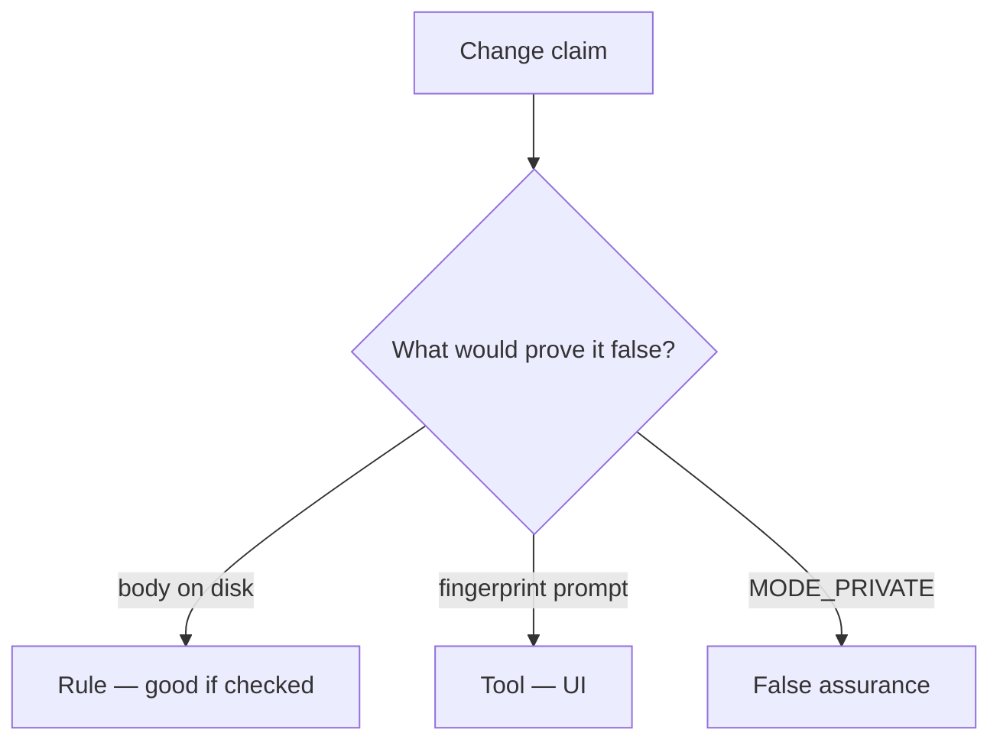

# Would you merge this cache.txt?

**Kind:** code-review
**Loop step:** Review

The answers are not on this page. Do not open the keys file until someone has looked at your review.

## What you are reviewing

Review `labs/8.2/8.2-lab/vulnerable/` as a change to the notes app’s offline cache. Check whether `save_note("secret")` still leaves `'secret'` on disk, compare that with the rule, and write changes a developer can verify.

The check you already ran (`test_cached_note_is_not_plaintext_on_disk`) is the rule check. A comment “we should wrap later” is not. A storage sticker in the ticket is not this review.

## Picture: write body to cache.txt

**Write body to cache.txt**. Label it **rule**, **tool**, or **false assurance** before you accept the change.

`plaintext_on_disk()` is still false. If the change never wraps then writes, that plaintext path is still open. A fingerprint prompt without that check is still the same problem.

`MODE_PRIVATE` keeps other apps out on a healthy OS; it does not encrypt. Backups and 4.1 logout wipe are other copies — name them, do not skip `test_cached_note_is_not_plaintext_on_disk`. Do not claim the lab `aead:` prefix is AES.

## Problems to find (name them yourself)

- Write body to cache.txt
- Backup allowed for the app
- No wipe on logout
- Note in notification text

Also reject: live device imaging; closing findings without re-running `test_cached_note_is_not_plaintext_on_disk`; keys in learner notes; claiming the lab prefix is AES.

## Common mix-ups this topic refuses

- A private app folder is encryption
- Fingerprint is MFA to the server
- Offline means no policy
- EncryptedSharedPreferences covers every file
- A storage nickname is the rule

## Practice

Write three review notes a peer could act on. Each note: what you saw, rule or false assurance, suggested structural change, leftover you will **not** delete. Tie at least one note to `test_cached_note_is_not_plaintext_on_disk`. Do not open the keys file.

## Use it somewhere new

A clinic change that “stored charts internally with a fingerprint lock” without a plaintext-on-disk check is an incomplete review. Name the independent falsehood that would still keep `'secret'` off disk.

## What this page is not doing

Do not merge by adding a comment “will wrap later.” That comment is leftover without an owner. Do not image a personal phone to prove the finding.
