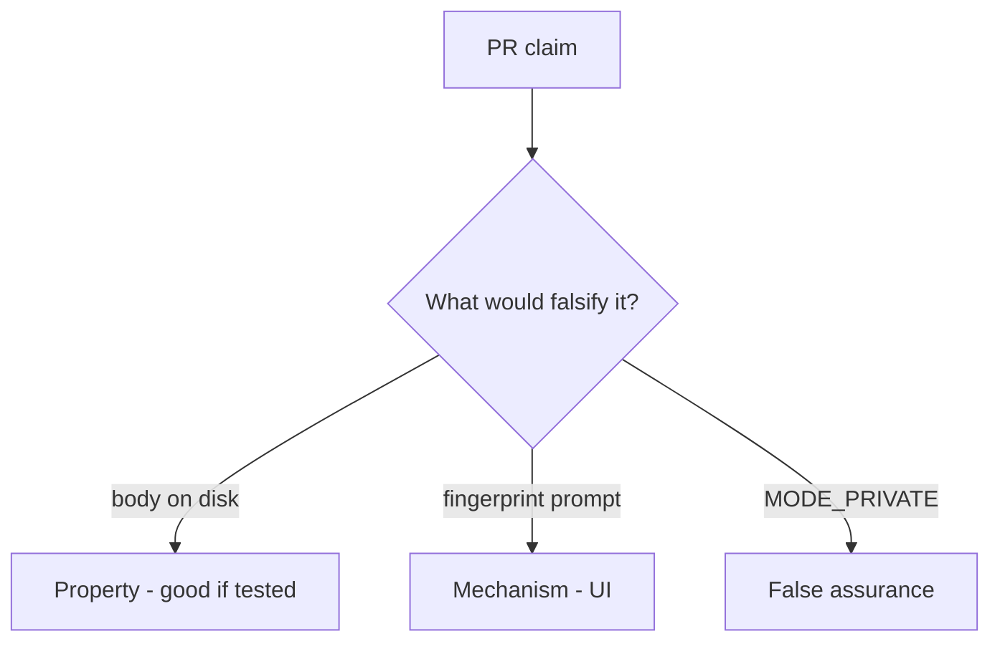

# 8.2-LO-08 — Review cache.txt as a PR, not a STORAGE sticker

**Kind:** code-review
**Loop step:** Review
**Standards:** OWASP MASVS 2.1.0 (final) `MASVS-STORAGE-1`. Do not use MASVS L1/L2/R.

## Review the fixture as if it were SecureCollab offline cache

Review `labs/8.2/8.2-lab/vulnerable/` as a SecureCollab PR. Your job is not to count suspicious lines. Reconstruct whether `save_note("secret")` still leaves `'secret'` on disk, compare that with the module invariant, and write changes a developer can verify.

Intended findings live only in `content/assessment/keys/8.2.md` — not here. Do not open the keys file until your review has been evaluated.

## Mental model: Write body to cache.txt

Start with this seeded smell: **Write body to cache.txt**. Label it property, mechanism, or false assurance before you accept the PR.

Classification starts at the protected effect (`plaintext_on_disk()` false). Everything that is not a wrap-then-write at that call is a candidate plaintext path. A fingerprint prompt without that pytest is the same smell, not a different finding class.

`MODE_PRIVATE` keeps other apps out on a healthy OS; it does not encrypt. STORAGE-2 backups and 4.1 logout wipe are other copies — name them, do not skip `test_cached_note_is_not_plaintext_on_disk`. Do not claim the lab `aead:` prefix is AES.

## Seeded smells (label them yourself)

- Write body to cache.txt
- Backup allowed for the app
- No wipe on logout
- Note in notification text

Also reject: live device imaging; closing findings without re-running `test_cached_note_is_not_plaintext_on_disk`; keys in lessons; claiming the lab prefix is AES.

## Misconceptions this module refuses

- Private app dir is encryption
- Fingerprint is MFA to the server
- Offline means no policy
- EncryptedSharedPreferences covers every file
- MASVS L1/L2/R are current levels

## Practice

Write three review notes a maintainer could act on. Each note: observation, property or false assurance, suggested structural change, residual you will **not** delete. Tie at least one to `test_cached_note_is_not_plaintext_on_disk`.

## Transfer

Clinic PR that “stored charts internally with a fingerprint lock” without a plaintext-on-disk test is an incomplete confidentiality review. Name the independent falsehood that would still keep `'secret'` off disk.

## Non-goals

Do not merge by adding a comment “will wrap later.” That comment is a residual without an owner. Do not image a personal phone to prove the finding.
