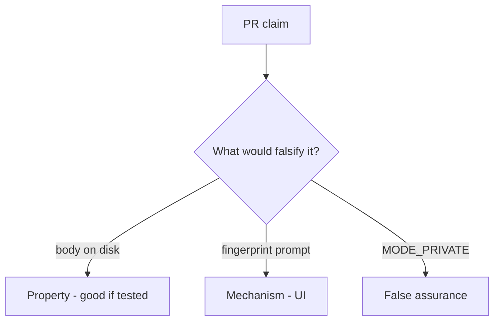

# 8.2-LO-08 — Review cache.txt as a PR, not a STORAGE sticker

**Kind:** code-review
**Loop step:** Review
**Standards:** OWASP MASVS 2.1.0 (final) `MASVS-STORAGE-1`.

## Review the fixture as if it were SecureCollab offline cache

Review `labs/8.2/8.2-lab/vulnerable/` as a SecureCollab PR. Intended findings live only in `content/assessment/keys/8.2.md` — not here.

## Mental model: Write body to cache.txt

Start with this seeded smell: **Write body to cache.txt**. Label it property, mechanism, or false assurance before you accept the PR.

Seeded smells (label them yourself; do not open the keys file):

- Write body to cache.txt
- Backup allowed for the app
- No wipe on logout
- Note in notification text

Also reject: live device imaging, keys in lessons, claiming the lab prefix is AES.

## Misconceptions

- Private app dir is encryption
- Fingerprint is MFA to the server
- Offline means no policy

## Practice

Write three review notes. Tie at least one to `test_cached_note_is_not_plaintext_on_disk`.

## Transfer

Clinic PR that “stored charts internally with a fingerprint lock” without a plaintext-on-disk test is incomplete.
