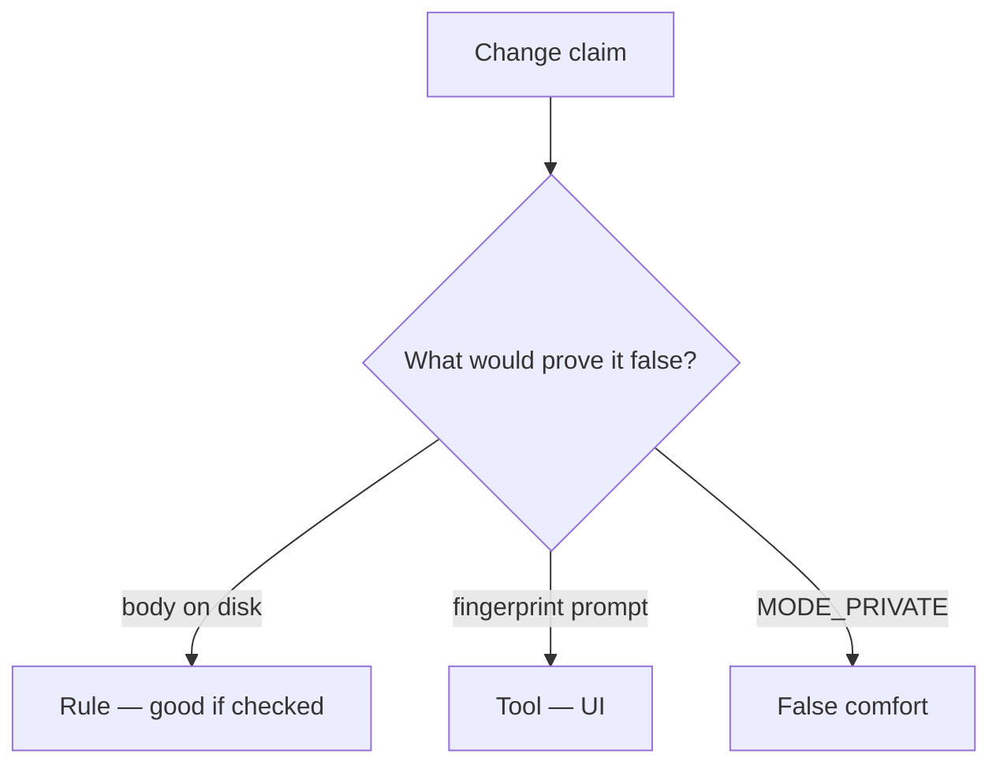

# Review cache.txt like a pull request

**Kind:** code-review
**Loop step:** Review

Intended findings live only in the answer-key folder — not here. Do not open that file until your review has been evaluated.

## What you are reviewing

A colleague ships the notes app’s offline cache. Review `labs/8.2/8.2-lab/vulnerable/` as that change. Your job is not to count suspicious lines. Reconstruct whether `save_note("secret")` still leaves `'secret'` on disk, compare that with the rule, and write changes a developer can verify.

The check you already ran (`test_cached_note_is_not_plaintext_on_disk`) is the rule check. A comment “we should wrap later” is not. A storage sticker in the ticket is not this review.

## Picture: write body to cache.txt

Start with this seeded smell: **Write body to cache.txt**. Label it **rule**, **tool**, or **false comfort** before you accept the change.

Classification starts at the protected effect (`plaintext_on_disk()` false). Everything that is not a wrap-then-write at that call is a candidate plaintext path. A fingerprint prompt without that pytest is the same smell, not a different finding class.

`MODE_PRIVATE` keeps other apps out on a healthy OS; it does not encrypt. Backups and 4.1 logout wipe are other copies — name them, do not skip `test_cached_note_is_not_plaintext_on_disk`. Do not claim the lab `aead:` prefix is AES.

## Seeded smells (label them yourself)

- Write body to cache.txt
- Backup allowed for the app
- No wipe on logout
- Note in notification text

Also reject: live device imaging; closing findings without re-running `test_cached_note_is_not_plaintext_on_disk`; keys in learner notes; claiming the lab prefix is AES.

## Common mix-ups this topic refuses

- A private app folder is encryption
- Fingerprint is MFA to the server
- Offline means no policy
- EncryptedSharedPreferences covers every file
- A storage nickname is the rule

## Practice

Write three review notes a peer could act on. Each note: what you saw, rule or false comfort, suggested structural change, leftover you will **not** delete. Tie at least one note to `test_cached_note_is_not_plaintext_on_disk`. Do not open the keys file.

## Use it somewhere new

A clinic change that “stored charts internally with a fingerprint lock” without a plaintext-on-disk check is an incomplete review. Name the independent falsehood that would still keep `'secret'` off disk.

## What this page is not doing

Do not merge by adding a comment “will wrap later.” That comment is leftover without an owner. Do not image a personal phone to prove the finding.
