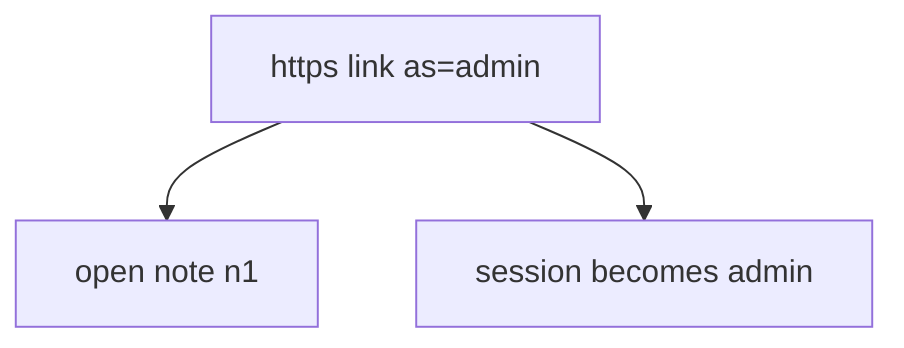
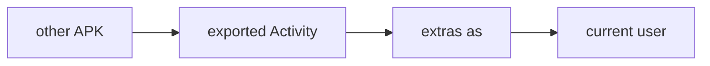

# 8.3-LO-01 — The Intent is untrusted input

**Kind:** concept-model
**Loop step:** 1 Property
**Standards:** OWASP MASVS 2.1.0 (final) `MASVS-PLATFORM-1`, `MASVS-PLATFORM-2`, `MASVS-AUTH-1`. RFC 8252 (final). ASVS `v5.0.0-8.3.1`.

## The claim this module owns

SecureCollab Android opens notes via App Links. The **session** is identity (4.3). The Intent extras and query string are **data** (2.1 / 7.1). A parameter `as=admin` must not become the principal.

> After `open_link({"as": "admin"})`, `current_user()` must still be `"alice"`.

The forbidden outcome is **deep link `as=` switches the signed-in user**. That is authenticity of the principal, not “the link was https.”

MASVS-PLATFORM-1 wants IPC used securely. PLATFORM-2 wants WebViews used securely (another interpreter — 6.2). AUTH-1 is protocol auth, not “the link said doctor.” RFC 8252 wants claimed HTTPS app links for OAuth redirects; custom schemes remain hijackable.

## Mental model: link locates, session authorizes



Verified App Links prove the *host* is associated with the app. They still deliver the query string.

## Mental model: exported means other apps can call



On older API levels `exported` defaults were surprising. Treat export as explicit.

**Mechanism (not the property):** “App Links verified,” “https,” “WebView is Chrome.”

## Root cause vs impact vs prevention vs detection vs recovery

| Slice | For this property |
|---|---|
| Root cause | Identity taken from the link |
| Preconditions | `open_link({as: admin})` sets admin |
| Trigger | Malicious app or crafted link |
| Impact | Local privilege / account switch |
| Prevention | Do not take identity from links; session stays server-issued |
| Detection | `deeplink_identity_ignored` |
| Recovery | Force re-login |

## Framework defaults versus the session guarantee

`exported=true` defaults on old Android. Custom schemes are first-come, first-served. WebView `addJavascriptInterface` is a new IPC.

## Mechanism limits

- Verified App Links still pass query strings.
- `javascript:` in WebView; file://; local servers (6.5).
- RFC 8252 custom-scheme residual; 4.5 audience still required after redirect.

## Usability and accessibility

Deep-link errors must not trap users in a broken WebView without a keyboard-accessible exit (WCAG 2.2).

## Practice

List exported components. Then run:

```
python3 -m pytest labs/8.3/8.3-lab/tests --impl vulnerable
python3 -m pytest labs/8.3/8.3-lab/tests --impl fixed
```

The first command must fail. The second must pass.

## Transfer

Clinic `as=doctor`. OAuth redirect to app (4.5).

## Non-goals

Live malicious APKs, Intent exploit cookbooks. Gates 0–10 and M0–M5 stay **not-attempted**. Answer keys are not in this file.
