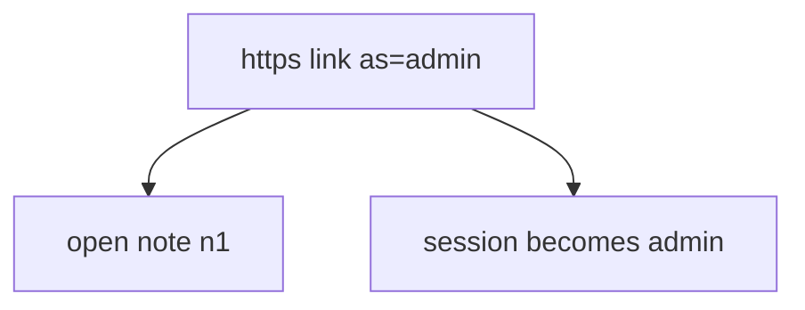
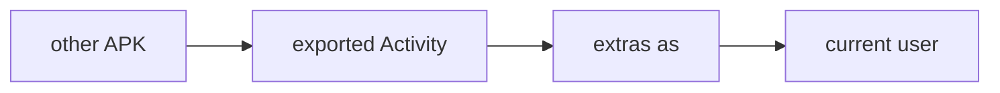

# The Intent is untrusted input

**Kind:** concept-model
**Loop step:** 1 Property

## The rule

The notes app this week opens notes from a link. The **session** is identity (4.3). The Intent extras and the query string are **data** (2.1 / 7.1). A parameter `as=admin` must not become the signed-in user.

> After `open_link({"as": "admin"})`, `current_user()` must still be `"alice"`. An honest locator such as `note=n1` may still open a note.

What must not happen: **a deep link `as=` switches the signed-in user**. That is authenticity of the principal, not “the link was https.”

Industry lists want IPC used securely. A WebView is another HTML interpreter (6.2), not this week’s session. Claimed HTTPS app links for OAuth redirects still leave custom schemes hijackable. “The link was https” is not this sentence.

## Picture: link locates, session authorizes



Verified App Links prove the *host* is associated with the app. They still deliver the query string.

## Picture: exported means other apps can call



On older API levels `exported` defaults were surprising. Treat export as explicit.

**A tool is not the rule.** “App Links verified,” “https,” “WebView is Chrome.”

## Why it happens, what it costs, how you stop it, how you notice, how you recover

| Slice | For this rule |
|---|---|
| Why it happens | Identity taken from the link |
| What has to be true first | `open_link({as: admin})` sets admin |
| Trigger | Other app on the tablet, or a crafted link |
| What it costs | Local privilege / account switch |
| How you stop it | Do not take identity from links; session stays server-issued |
| How you notice | `deeplink_identity_ignored` |
| How you recover | Force re-login |

## What the framework does vs what you still have to check

`exported=true` defaults on old Android. Custom schemes are first-come, first-served. WebView `addJavascriptInterface` is a new IPC. None of those defaults is this week’s session.

The app’s promise is: **this** `open_link`, `as=admin` does not become the user. The practice folder is `labs/8.3/8.3-lab`. It is local only. It is not a live app.

## What the tool cannot do

- Verified App Links still pass query strings.
- `javascript:` in a WebView; `file://`; local servers (6.5).
- Custom-scheme leftover; 4.5 audience still required after a redirect.
- A new exported Activity can copy extras again.

## Can people still use it

Deep-link errors must not trap people in a broken WebView with no keyboard-accessible way out (WCAG 2.2).

## Practice

List exported components. Then run:

```text
python3 -m pytest labs/8.3/8.3-lab/tests --impl vulnerable
python3 -m pytest labs/8.3/8.3-lab/tests --impl fixed
```

The first command must fail. The second must pass.

## Use it somewhere new

Clinic `as=doctor`. OAuth redirect to the app (4.5).

## What this page is not doing

Live malicious APKs, Intent cookbooks. Gates 0–10 and milestones M0–M5 stay **not-attempted**. Answer keys are not in this file.
