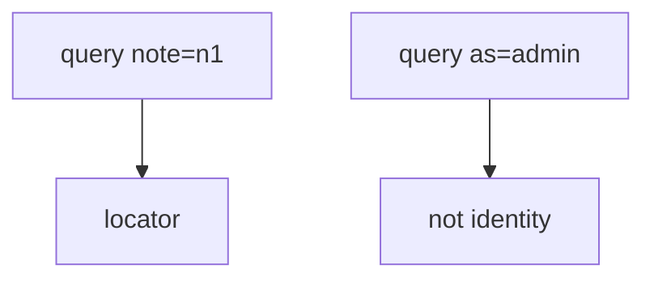
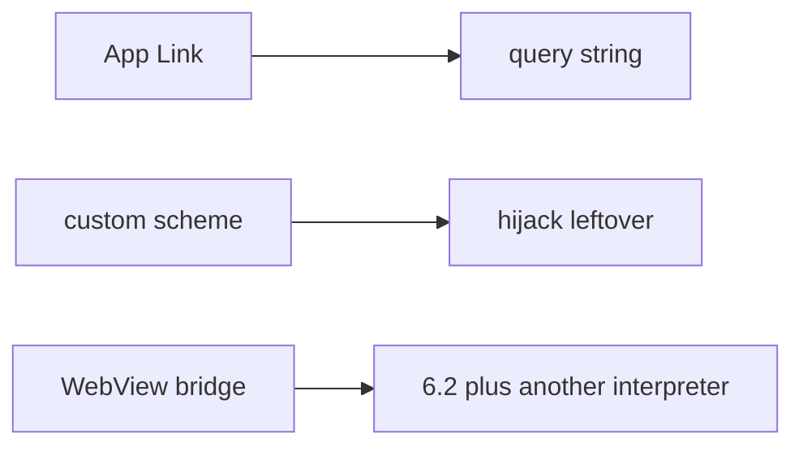

# Exported components and query strings

**Kind:** design-exercise
**Loop step:** 2 Model

## Could someone else name the checks from your map?

“App Links are verified” does not name **each exported entry and which query keys it may honor**.

`open_link` / `current_user` — no live apps.

## Picture: locate versus impersonate

## Picture: three IPC grains

If App Links are verified and `open_link` still copies `as`, the map has a hole. The host check is how the OS *finds* the app. It is not the session.

## Step 1: name the pieces

| Piece | This system |
|---|---|
| Who | alice session; other app on the tablet |
| What | session principal; note id |
| Actions | `open_link` |
| Paths | query dict (practice stand-in for Intent extras) |
| What you trust | ignore identity keys |
| What you do not trust | all extras |
| Time | current session |
| Authorization cell | authenticity of the principal |

## Step 2: write cells the practice can fail

| Who | What | Action | Decision |
|---|---|---|---|
| alice | `note=n1` | open | allow locate |
| anyone | `as=admin` | switch | deny |
| App Link cert | host | verify | not identity |
| WebView | JS bridge | call | leftover, another interpreter |

## Practice

Look at `link.py` under `labs/8.3/8.3-lab`. Label the extras even in the repaired tree — the fix is ignore identity keys, not pretending a verified host became the session.

## Use it somewhere new

OAuth redirect query `code=` is data for 4.5, not a session switch.

## What can still go wrong

Custom scheme. WebView. User installs an attacker app. 8.2 clipboard.

## What this page is not doing

Answer keys are not on this site.
