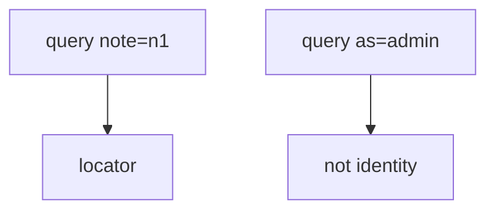
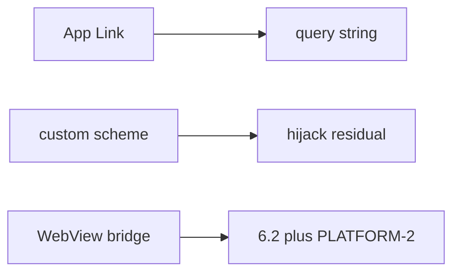

# 8.3-LO-02 — Exported components and query strings

**Kind:** design-exercise
**Loop step:** 2 Model
**Standards:** OWASP MASVS 2.1.0 (final) `MASVS-PLATFORM-1`. RFC 8252.

## Can a second engineer name pytest cases from your IPC map?

“App Links are verified” is not this lesson. A reviewable model names **each exported entry and which query keys it may honor**.

SecureCollab Phase 8 freeze: local `open_link` / `current_user`. No live apps.

## Mental model: locate versus impersonate

## Mental model: three IPC grains

## Step 1: freeze pieces

| Piece | This system |
|---|---|
| Subjects | alice session; malicious other app |
| Objects | session principal; note id |
| Actions | `open_link` |
| Channels | query dict (lab stand-in for Intent extras) |
| TCB | ignore identity keys |
| Untrusted | all extras |
| State / time | current session |
| 1.1 cell | authenticity of the principal |

## Step 2: write cells

| Subject | Object | Action | Decision |
|---|---|---|---|
| alice | `note=n1` | open | allow locate |
| anyone | `as=admin` | switch | deny |
| App Link cert | host | verify | not identity |
| WebView | JS bridge | call | PLATFORM-2 residual |

## Practice

Draw the inventory. Point at `labs/8.3/8.3-lab` file `link.py`.

## Transfer

OAuth redirect query `code=` is data for 4.5, not a session switch.

## Residual risk

Custom scheme; WebView; user installs attacker app; 8.2 clipboard.

## Non-goals

Top 10 as the definition of security. Keys stay out of lessons.
