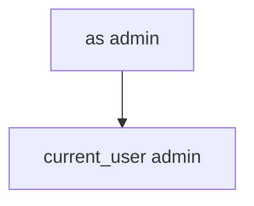

# 8.3-LO-03 — Observe as= switch, do not install a malware APK

**Kind:** mechanism-lab
**Loop step:** 3 Break
**Standards:** OWASP MASVS 2.1.0 (final) `MASVS-PLATFORM-1`. PLATFORM-2 (WebViews) is a paired residual. AUTH-1 is protocol auth, not “the link said doctor.” RFC 8252 (final) for claimed HTTPS app links. ASVS `v5.0.0-8.3.1`. Do not use MASVS L1/L2/R.

## Authorized scope

`labs/8.3/8.3-lab` only. The fixture is an in-process `open_link(query)` / `current_user()`. Synthetic query dicts (`as`, `note`). No live Intents, no sideloaded attacker apps, no public deep-link probing.

**Forbidden outcome:** Deep link `as=` switches the signed-in user. After `open_link({"as": "admin"})`, `current_user()` is `"admin"`.

Attacker capability in this lab: another app on the tablet sending extras, or a crafted link. That stands in for a clinic kiosk demo `as=doctor`, an exported Activity, or a WebView that forwards query identity. Trust assumption: `open_link` is supposed to treat extras as **data** (2.1 / 7.1); the session stays server-issued (4.3). Verified App Links, `https`, and `exported=false` without a test are not in the TCB for this cell.

## Mental model: extras become the user



The vulnerable tree demonstrates **cause** (identity from the link). Do not send Intents at anything except this fixture. Preconditions: `open_link` copies `as` onto the session. You do not need Android. You must not install a malware APK.

MASVS-PLATFORM-1 wants IPC used securely. Module 4.3 already said the session is identity; this cell is **the Intent must not become the principal**.

## What to read in the fixture

`vulnerable/link.py` copies `as` onto the session. Tests:

- `test_deeplink_as_param_does_not_switch_user`
- `test_note_deep_link_keeps_session` — locators must not switch users either

You do not need a new query key. The failure of `test_deeplink_as_param_does_not_switch_user` *is* the evidence.

Do not open the fixed tree yet. Diagnose the cause first.

## Root cause vs impact vs prevention vs detection vs recovery

| Slice | This lab |
|---|---|
| Required property | After `open_link({"as": "admin"})`, `current_user()` is still `"alice"` |
| Root cause | Identity taken from the link |
| Preconditions | `as` in query is copied onto the session |
| Trigger | Malicious app or crafted link |
| Impact | Local privilege / account switch |
| Prevention | Do not take identity from links; session stays server-issued |
| Detection | `deeplink_identity_ignored`; never the full URL or token |
| Recovery | Keep alice; force re-login if already flipped |
| Not the lesson | MASWE as a live-target cookbook; App Links as identity |

## Framework defaults versus the session guarantee

`exported=true` defaults on old Android. Custom schemes are first-come, first-served. Verified App Links prove the *host* is associated with the app; they still deliver the query string. FastAPI will bind `as=admin` if you put it on a cookie. The application guarantee is: **this** fixture, alice stays alice.

## Practice

```text
python3 -m pytest labs/8.3/8.3-lab/tests --impl vulnerable
```

Run from `labs/8.3/8.3-lab` if a repo-root collection picks up `site/`. Record `test_deeplink_as_param_does_not_switch_user`. Do not probe public hosts. An environment error is not security evidence.

## Transfer

Clinic `as=doctor`. Predict without leaving this directory. Do not send Intents at a live EHR.

## Non-goals

No live-target instructions. Synthetic `'alice'` / `'admin'` only. Do not dump Intent exploit cookbooks.
