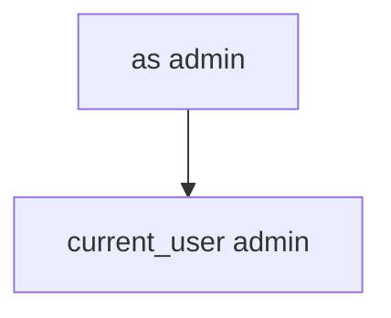

# Practice: as=admin switches the session

**Kind:** mechanism-lab
**Loop step:** 3 Break

## Try it

The practice is not a phone you attack. `open_link(query)` / `current_user()`: extras become the user, so `as=admin` switches the session. You do not need a public app to see that switch.

> After `open_link({"as": "admin"})`, `current_user()` must still be `"alice"`. The Intent is untrusted input.

## Where you may practice

Stay inside `labs/8.3/8.3-lab`. Fake query dicts (`as`, `note`) land in `open_link(query)` / `current_user()`. It does not open a network. Do not send Intents at a live app, sideload an attacker APK, or probe a public deep link.

Do not paste this exercise onto a public app, employer clinic, or live EHR.

What must not happen: **`as=admin` switches the session**. After `open_link({"as": "admin"})`, `current_user()` is `"admin"`.

Picture another app on the tablet sending extras, or a crafted link — a clinic kiosk demo `as=doctor`, an exported Activity, or a WebView that forwards query identity. `open_link` is supposed to treat extras as **data** (2.1 / 7.1); the session stays server-issued (4.3). Verified App Links, `https`, and `exported=false` without a test are not enough.

## Picture: extras become the user



Identity comes from the link. Do not send Intents at anything except these local files. `open_link` copies `as` onto the session. You do not need Android. You must not install a malware APK.

Last topic already said the session is identity (4.3). This rule is **the Intent must not become the principal**.

## What to read in the broken files

`vulnerable/link.py` copies `as` onto the session. Checks:

- `test_deeplink_as_param_does_not_switch_user`
- `test_note_deep_link_keeps_session` — locators must not switch users either

## Why it happens vs what it costs

| Slice | This practice |
|---|---|
| Required rule | After `open_link({"as": "admin"})`, `current_user()` is still `"alice"` |
| Why it happens | Identity taken from the link |
| What's already wrong | `as` in the query is copied onto the session |
| Trigger | Other app on the tablet, or a crafted link |
| What it costs | Local privilege / account switch |
| How you stop it | Do not take identity from links; session stays server-issued |
| How you notice | `deeplink_identity_ignored`; never the full URL or token |
| How you recover | Keep alice; force re-login if already flipped |
| Not the lesson | A bug-list sticker, App Links as identity, or a live APK |

## What the framework does vs what you still have to check

`exported=true` defaults on old Android. Custom schemes are first-come, first-served. Verified App Links prove the *host* is associated with the app; they still deliver the query string. FastAPI will bind `as=admin` if you put it on a cookie. Alice stays alice.

## Practice

```text
python3 -m pytest labs/8.3/8.3-lab/tests --impl vulnerable
```

Run from `labs/8.3/8.3-lab` if a repo-root collection picks up `site/`. Do not “fix” the check to pass. Do not probe public hosts. A setup error is not proof the rule holds.

## Use it somewhere new

Clinic `as=doctor`. Predict without leaving this directory. Do not send Intents at a live EHR.

## What this page is not doing

No live-target steps. Fake `'alice'` / `'admin'` only. Do not dump the helper into notes as a public-app cookbook.
