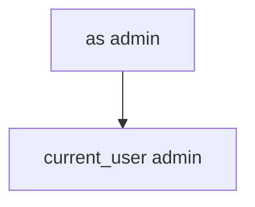

# 8.3-LO-03 — Observe as= switch, do not install a malware APK

**Kind:** mechanism-lab
**Loop step:** 3 Break
**Standards:** OWASP MASVS 2.1.0 (final) `MASVS-PLATFORM-1`.

## Authorized scope

`labs/8.3/8.3-lab` only. Synthetic query dicts. No live Intents, no sideloaded attacker apps.

**Forbidden outcome:** Deep link `as=` switches the signed-in user.

## Mental model: extras become the user



The vulnerable tree demonstrates **cause** (identity from the link). Do not send Intents at anything except this fixture.

## What to read in the fixture

`vulnerable/link.py` copies `as` onto the session. Tests require `current_user()` stay `'alice'`.

## Root cause vs impact

| Slice | Lab |
|---|---|
| Root cause | Identity taken from the link |
| Impact | Local account switch |
| Not the lesson | MASWE-0029 as a live-target cookbook |

## Practice

```
python3 -m pytest labs/8.3/8.3-lab/tests --impl vulnerable
```

Record `test_deeplink_as_param_does_not_switch_user`. Do not probe public hosts.

## Transfer

Clinic `as=doctor`. Predict without leaving this directory.

## Non-goals

No live-target instructions. Synthetic `'alice'` / `'admin'` only.
