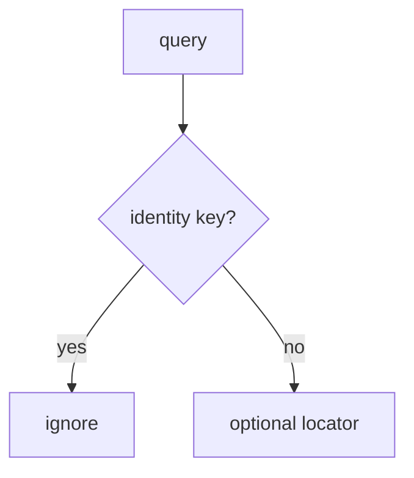

# Ignore identity parameters on links

**Kind:** design-exercise
**Loop step:** 4 Build

## The rule

Verified App Links do not ignore `as=admin`. An https scheme does not ignore it. `exported=false` without a test still leaves extras readable.

The repair: `open_link` **does not copy identity keys onto `current_user`**. Locators such as `note=` may be honored later; this practice ignores extras entirely as the smallest fix. Ignore identity parameters on links.

Restore the notes app’s App Links with this: `as=admin` keeps alice. Unknown keys do not switch users. That is not a pass — even if the Activity was exported “for sharing.”

## Picture: extras never become the principal



The repaired files ignore extras entirely (`open_link` returns without writing SESSION). Production may still honor locators such as `note=n1` after 1.2 / 4.4 — this check only requires the principal stay alice. Verified App Links still pass query strings. Custom schemes remain hijackable. WebView `addJavascriptInterface` is a new IPC (6.2).

Authorization belongs on a trusted service layer — `open_link({"as": "admin"})`.

## What the repaired files must show

| After the fix | Must be true |
|---|---|
| `as=admin` | still alice |
| `note=n1` | still alice |

By default, if the key is identity, **do not copy it**. Do not keep copying extras because “App Links are verified.”

## What this is not

- Verified App Links as trusted input.
- `exported=false` without a test.
- WebView allow-list as the session.
- HTTPS as identity.
- Custom-scheme “ours only.”

## What the tool cannot do

- Verified App Links still pass query strings.
- `javascript:` in a WebView; `file://`; local servers (6.5).
- Custom-scheme leftover; 4.5 audience still required after a redirect.
- A new exported Activity can copy extras again.
- 7.1 extra keys on write remain a different binder.

## Practice

Name the predicate (identity keys ignored; session stays server-issued). Run:

```text
python3 -m pytest labs/8.3/8.3-lab/tests --impl fixed
```

## Use it somewhere new

Stop treating `as=doctor` as a convenient demo login.

## What can still go wrong

WebView bridges. Custom schemes. 4.5 after a valid redirect. Attacker app installed. New exported components.

## What this page is not doing

Do not install a malware APK. Do not claim Gate 8 from an App Links screenshot.
