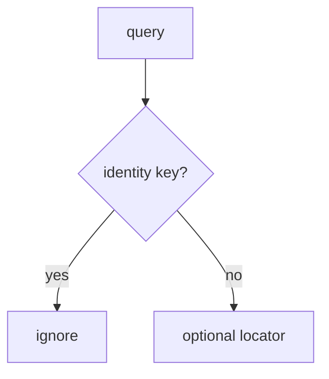

# 8.3-LO-04 — Ignore identity parameters on links

**Kind:** design-exercise
**Loop step:** 4 Build
**Standards:** OWASP MASVS 2.1.0 (final) `MASVS-PLATFORM-1`. ASVS 5.0.0 (final) `v5.0.0-8.3.1`. RFC 8252 (final) claimed HTTPS app links. PLATFORM-2 WebView is a residual.

## Structural means the session does not read `as`

`open_link` must not copy query identity keys onto `current_user`. Locators such as `note=` may be honored later; this lab ignores extras entirely as the smallest fix. Structural means that ignore — not “https,” not App Links, not `exported=false` without a test.

The smallest restore for SecureCollab App Links is: `as=admin` keeps alice. Fail-safe: unknown keys do not switch users. Do not fail open because the Activity was exported “for sharing.”

## Mental model: extras never become the principal



The lab’s fixed tree ignores extras entirely (`open_link` returns without writing SESSION). Production may still honor locators such as `note=n1` after 1.2 / 4.4 — this pytest only requires the principal stay alice. Verified App Links still pass query strings. Custom schemes remain hijackable (RFC 8252 residual). WebView `addJavascriptInterface` is a new IPC (PLATFORM-2 / 6.2).

ASVS `v5.0.0-8.3.1` wants authorization on a trusted service layer. This pytest is that sentence for `open_link({"as": "admin"})`.

## Why this restores the cell

| After the fix | Must be true |
|---|---|
| `as=admin` | still alice |
| `note=n1` | still alice |

## What this is not

Verified App Links as trusted input. `exported=false` without a test. WebView allow-list as the session. HTTPS as identity. Custom-scheme “ours only.”

## Mechanism limits

- Verified App Links still pass query strings.
- `javascript:` in WebView; file://; local servers (6.5).
- RFC 8252 custom-scheme residual; 4.5 audience still required after redirect.
- A new exported Activity can copy extras again.
- 7.1 extra keys on write remain a different binder.

## Practice

Name the predicate (identity keys ignored; session stays server-issued). Run:

```text
python3 -m pytest labs/8.3/8.3-lab/tests --impl fixed
```

Must pass. Run from the lab directory if collection at repo root is polluted.

## Transfer

Clinic: stop treating `as=doctor` as a convenient demo login.

## Residual risk

WebView bridges; custom schemes (RFC 8252); 4.5 after a valid redirect; attacker app installed; new exported components.

## Non-goals

Do not install a malware APK. Do not claim Gate 8 from an App Links screenshot. Do not teach MASVS L1/L2/R as current levels.
