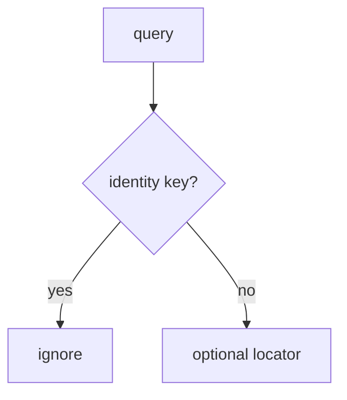

# 8.3-LO-04 — Ignore identity parameters on links

**Kind:** design-exercise
**Loop step:** 4 Build
**Standards:** OWASP MASVS 2.1.0 (final) `MASVS-PLATFORM-1`. ASVS `v5.0.0-8.3.1`.

## Structural means the session does not read `as`

`open_link` must not copy query identity keys onto `current_user`. Locators such as `note=` may be honored later; this lab ignores extras entirely as the smallest fix. Structural means that ignore — not “https,” not App Links.

## Mental model: extras never become the principal



Fail-safe: unknown keys do not switch users.

## Why this restores the cell

| After the fix | Must be true |
|---|---|
| `as=admin` | still alice |
| `note=n1` | still alice |

## What this is not

Verified App Links as trusted input. `exported=false` without a test. WebView allow-list as the session.

## Practice

Name the predicate. Run:

```
python3 -m pytest labs/8.3/8.3-lab/tests --impl fixed
```

Must pass.

## Transfer

Clinic: stop treating `as=doctor` as a convenient demo login.

## Residual risk

WebView bridges; custom schemes (RFC 8252); 4.5 after a valid redirect.
