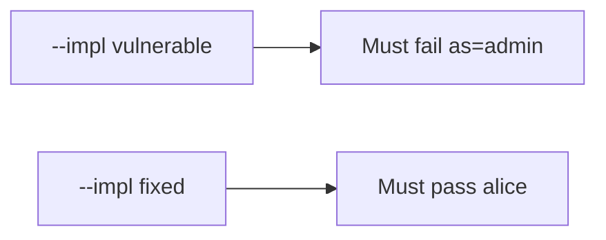

# 8.3-LO-05 — Evidence is alice unchanged, then a passing pair

**Kind:** verification-lab
**Loop step:** 5 Verify
**Standards:** OWASP MASVS 2.1.0 (final) `MASVS-PLATFORM-1`.

## An invariant that cannot fail a test is still a slogan

“App Links are verified” is not evidence. The oracle is the local pair. Do not fire live Intents.

## Mental model: fail-on-vulnerable, pass-on-fixed



| Case | Must show |
|---|---|
| Negative / abuse | `as=admin` keeps alice |
| Normal | `note=n1` keeps alice |
| Not claimed | WebView; custom schemes; live OAuth |

```
python3 -m pytest labs/8.3/8.3-lab/tests --impl vulnerable
python3 -m pytest labs/8.3/8.3-lab/tests --impl fixed
```

Honest note locators may pass on both.

## What the tests do not prove

- PLATFORM-2 WebView bridges
- RFC 8252 claimed HTTPS in production
- `exported` flags on a real manifest

## Practice

Execute both implementations. Map each test to an LO-02 cell.

## Transfer

Clinic: a test that only asserts the Activity launched is not this cell.
