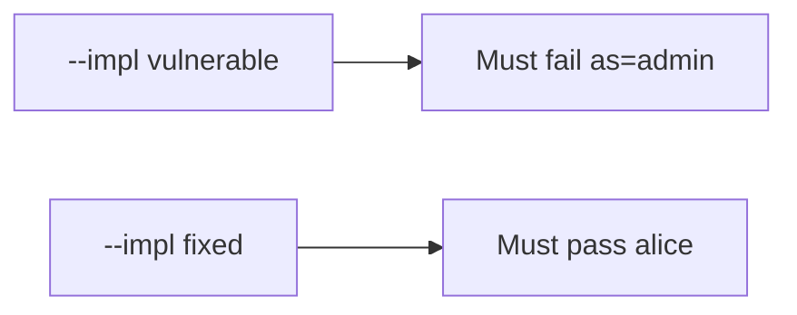

# 8.3-LO-05 — Evidence is alice unchanged, then a passing pair

**Kind:** verification-lab
**Loop step:** 5 Verify
**Standards:** OWASP MASVS 2.1.0 (final) `MASVS-PLATFORM-1`.

## An invariant that cannot fail a test is still a slogan

“App Links are verified” is not evidence. “The link is https” is a mechanism observation. The oracle is: after `open_link({"as": "admin"})`, `current_user()` is still `"alice"`. The `as=admin` observation must be **false** on `--impl vulnerable` (session becomes admin) and **true** on `--impl fixed`. Do not fire live Intents.

## Mental model: vulnerable must fail: as=admin

The failing observation on `--impl vulnerable` is **as=admin**. A passing collection count is not this cell.



| Mode | Must show for this module |
|---|---|
| Negative / abuse | `as=admin` keeps alice; vulnerable must fail |
| Normal | `note=n1` keeps alice (may pass on both) |
| Not claimed | WebView; custom schemes; live OAuth; real `exported` flags |

Lab tests in `labs/8.3/8.3-lab/tests/test_property.py`. `test_deeplink_as_param_does_not_switch_user` is a **forbidden-outcome** test: a link that switches the principal is not allowed to count as a passing control.

```text
python3 -m pytest labs/8.3/8.3-lab/tests --impl vulnerable
python3 -m pytest labs/8.3/8.3-lab/tests --impl fixed
```

Honest note locators may pass on both implementations. That does not excuse the `as=` deny test. If vulnerable does not fail `test_deeplink_as_param_does_not_switch_user`, the lab is miswired—fix the wiring, not the assertion.

## What the tests do not prove

- PLATFORM-2 WebView bridges
- RFC 8252 claimed HTTPS in production
- `exported` flags on a real manifest
- 4.5 audience after a valid OAuth redirect
- That a locator `note=n1` is authorized (4.4)

Record those as residuals or later modules, not as silent passes.

## Practice

Execute both implementations this session from the lab directory if needed. Write the fail/pass pair next to the matrix row. Reject a “test” that only greps `android:autoVerify` without calling `open_link({"as": "admin"})`.

## Transfer

Clinic: a test that only asserts the Activity launched is not this cell. A sideloaded malware APK is out of scope.

## Non-goals

Do not add a live Intent trophy. Do not log full URLs that contain tokens. Keys stay out of this file.
