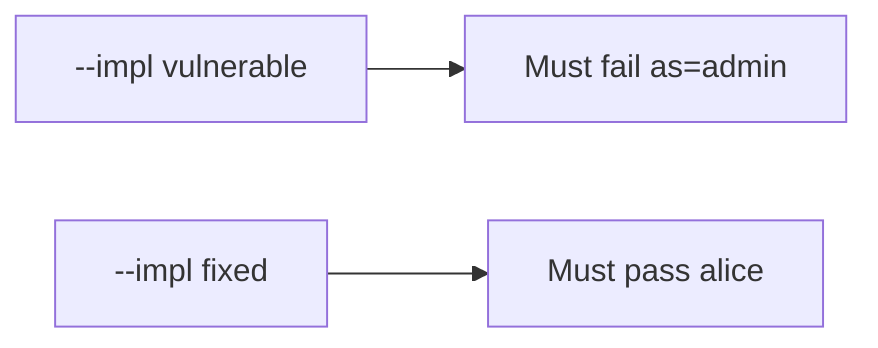

# The broken files must fail when a link claims admin

**Kind:** verification-lab
**Loop step:** 5 Verify

## If you cannot test it, it is still a slogan

“App Links are verified” is not evidence. “The link is https” is a tool observation. The check is: after `open_link({"as": "admin"})`, `current_user()` is still `"alice"`. The `as=admin` observation must be **false** on `--impl vulnerable` (session becomes admin) and **true** on `--impl fixed`. Do not fire live Intents.

## Picture: broken files must fail: as=admin

A check that only counts passing cases can pass while `as=` still switches the session. This check asks whether a link that switches the principal still counts as a passing control. Broken must fail that question. Repaired must pass it.



If both pass, the check is not looking at identity keys. If both fail, the fix is not structural or the check is wrong.

## Three observations, even for a link

| Mode | Must show for this topic |
|---|---|
| Normal | `note=n1` keeps alice (`test_note_deep_link_keeps_session`; may pass on both) |
| Wrong input / abuse | `as=admin` keeps alice; broken files must fail (`test_deeplink_as_param_does_not_switch_user`) |
| Not claimed | WebView; custom schemes; live OAuth; real `exported` flags |

Practice checks live in `labs/8.3/8.3-lab/tests/test_property.py`. `test_deeplink_as_param_does_not_switch_user` is a **what-must-not-happen** check: a link that switches the principal is not allowed to count as a passing control.

```text
python3 -m pytest labs/8.3/8.3-lab/tests --impl vulnerable
python3 -m pytest labs/8.3/8.3-lab/tests --impl fixed
```

Honest note locators may pass on both implementations. That does not excuse the `as=` deny check. If the broken files do not fail `test_deeplink_as_param_does_not_switch_user`, the practice is miswired — fix the wiring, not the check.

## What the checks do not prove

- WebView bridges (6.2)
- Claimed HTTPS App Links in production
- `exported` flags on a real manifest
- 4.5 audience after a valid OAuth redirect
- That a locator `note=n1` is authorized (4.4)

Record those as leftover risk or later topics, not as silent passes.

## Practice

Run both implementations this session from the lab directory if needed. Write the fail/pass pair next to the map-page row. Reject a “check” that only greps `android:autoVerify` without calling `open_link({"as": "admin"})`. A setup error is not proof the rule holds.

## Use it somewhere new

A clinic example: a check that only asserts the Activity launched is not this rule. A sideloaded malware APK is out of scope.

## What this page is not doing

Do not treat a live Intent screenshot as proof. Do not log full URLs that contain tokens. Answer keys are not on this site.
