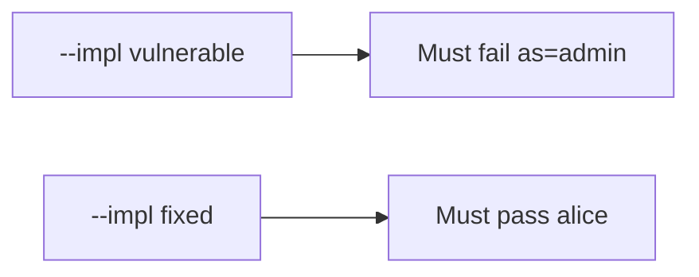

# The broken files must fail when a link claims admin

**Kind:** verification-lab
**Loop step:** 5 Verify

## Check it

Verified App Links do not ignore `as=admin`. An https link is a scheme. After `open_link({"as": "admin"})`, `current_user()` has to stay `"alice"`. The leftover build: the session becomes admin. Repair keeps `current_user()` as `"alice"`. Do not fire live Intents.

## Picture: broken files must fail: as=admin

`as=` can still switch the session even when other tests pass.



If the broken link still passes, identity keys in extras were never dropped.

## Three things to look at

| Mode | Must show for this topic |
|---|---|
| Normal | `note=n1` keeps alice (`test_note_deep_link_keeps_session`; may pass on both) |
| Wrong input / abuse | `as=admin` keeps alice; broken files must fail (`test_deeplink_as_param_does_not_switch_user`) |
| Not claimed | WebView; custom schemes; live OAuth; real `exported` flags |

The checks are in `labs/8.3/8.3-lab/tests/test_property.py`. `test_deeplink_as_param_does_not_switch_user` is there so a link that switches the principal still fails.

```text
python3 -m pytest labs/8.3/8.3-lab/tests --impl vulnerable
python3 -m pytest labs/8.3/8.3-lab/tests --impl fixed
```

Do not let a deep link that only names the note hide the leftover. Ignore `as=`. If the broken files do not fail `test_deeplink_as_param_does_not_switch_user`, the practice is miswired — fix the wiring, not the check.

## What the checks do not prove

- WebView bridges (6.2)
- Claimed HTTPS App Links in production
- `exported` flags on a real manifest
- 4.5 audience after a valid OAuth redirect
- That a locator `note=n1` is authorized (4.4)

## Practice

Call `open_link({"as": "admin"})`. `android:autoVerify` is the App Link flag. A setup error is not proof the rule holds.

## Use it somewhere new

An Activity that launched is the Intent, not `current_user()` still alice. Do not use a sideloaded malware APK.

## What this page is not doing

A live Intent screenshot is not `current_user()` still alice. Do not log full URLs that contain tokens. Answer keys are not on this site.
